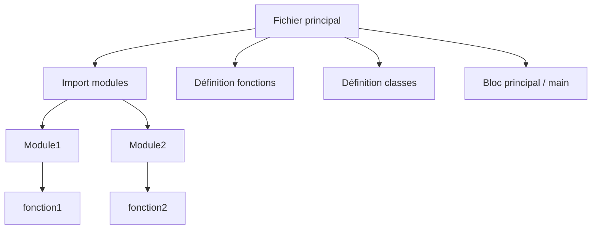

# Séance 1 – Introduction à l’optimisation et à la sécurité

## Partie 1 – Qu’est-ce qu’un code optimisé ?

### 1. Lisibilité : conventions de nommage, commentaires, structure

---

### Introduction

Un code optimisé ne se résume pas uniquement à des performances techniques (rapidité, faible consommation mémoire), il inclut aussi une excellente lisibilité. Le code est destiné à être lu plusieurs fois, souvent par d'autres développeurs que celui qui l’a écrit. La lisibilité facilite la maintenance, le débogage et l’évolution du logiciel.

---

### A. Conventions de nommage

Les conventions de nommage permettent de rendre le code compréhensible dès la lecture des noms de variables, fonctions, classes, etc. Voici les bonnes pratiques courantes :

- **Noms explicites et parlants** : Un nom doit décrire clairement le rôle de l'élément.
  
  Exemple : `totalPrix` est plus clair que `tp`.

- **Utilisation cohérente du style de nommage** :
  - camelCase : `totalPrix` (souvent utilisé pour variables et fonctions)
  - PascalCase : `TotalPrix` (souvent utilisé pour les classes)
  - snake_case : `total_prix` (utilisé selon certains langages comme Python)

- **Éviter les abréviations obscures** : Elles compliquent la compréhension.

- **Respecter les conventions du langage** : chaque langage a des recommandations spécifiques qui facilitent la cohérence dans un projet.

---

### B. Commentaires

Les commentaires doivent ajouter une valeur explicative sans surcharger le code.

- **Commentaires clairs et concis** : Expliquer le _pourquoi_ plutôt que le _comment_ (car le code doit s’auto-expliquer).

- **Ne pas commenter l’évidence** : Exemples inutiles comme `i = 0; // on initialise i à zéro` sont à proscrire.

- **Utiliser les commentaires pour** :
  - décrire des choix d’implémentation spécifiques
  - expliquer des algorithmes complexes
  - indiquer des TODO ou problèmes connus
  - marquer des sections importantes

- **Commentaires maintenus à jour** : Un commentaire erroné nuit à la compréhension.

**Exemple :**

```python
# Tri rapide: algorithme efficace en moyenne O(n log n)
def quick_sort(arr):
    ...
```

---

### C. Structure du code

La structuration du code organise les différentes parties de façon logique et facilite la navigation.

- **Modularisation** : Diviser le code en fonctions/méthodes et modules avec une responsabilité claire.

- **Respect du principe de responsabilité unique (SRP)** : chaque unité fait une chose bien précise.

- **Indentation cohérente** : indispensable pour la lisibilité, certains langages (Python) l’imposent.

- **Organisation en sections/niveaux** :
  - Déclarations/imports en début de fichier
  - Définition des fonctions et classes
  - Point d’entrée du programme à la fin

- **Utilisation d’espaces et lignes vides** pour aérer le code sans créer trop de blancs.

---

### Diagramme Mermaid illustrant la structure modulaire d’un programme



Ce diagramme montre une organisation logique : un fichier principal importe des modules, qui contiennent des fonctions clairement délimitées.

---

### Exemples concrets

1. **Nommage explicite**

```python
# Mauvais
def calc(a, b):
    return a + b

# Bon
def calculer_somme(prix_produit1, prix_produit2):
    return prix_produit1 + prix_produit2
```

2. **Bon usage des commentaires**

```python
# Calcul du montant TTC avec TVA à 20%
def calculer_prix_ttc(prix_ht):
    TVA = 0.20
    return prix_ht * (1 + TVA)
```

3. **Structure modulaire**

Fichier `math_utils.py` :

```python
def addition(a, b):
    return a + b

def soustraction(a, b):
    return a - b
```

Fichier `main.py` :

```python
from math_utils import addition, soustraction

def main():
    print(addition(4, 7))
    print(soustraction(10, 3))

if __name__ == "__main__":
    main()
```

---

### Références utilisées

- Aalpha, *Code Quality Standards and Best Practices 2025*, https://www.aalpha.net/blog/code-quality-standards-and-best-practices/
- Index.dev, *Code Optimization Strategies for Faster Software in 2025*, https://www.index.dev/blog/code-optimization-strategies
- Medium, *Best Practices for Writing Effective Comments in 2025*, https://medium.com/@tochukwupatrick2003/best-practices-for-writing-effective-comments-in-2024-a-professionals-guide-880eb9c7db45
- Netguru, *11 Software Development Best Practices in 2025*, https://www.netguru.com/blog/best-software-development-practices

---

### Conclusion

Un code optimisé est lisible, bien structuré et commenté à bon escient. Les conventions de nommage claires, les commentaires qui ajoutent du sens, et une organisation logique du code améliorent grandement la maintenabilité et la performance globale d’un projet logiciel. Ces bonnes pratiques sont la base indispensable avant d’aborder les optimisations techniques plus avancées.