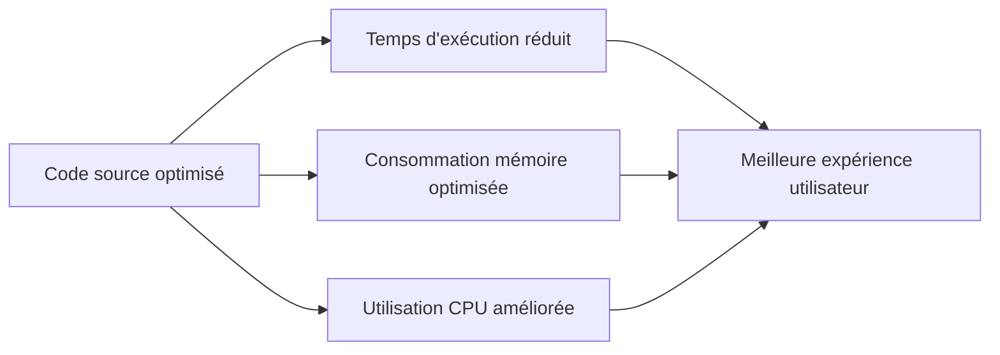

# Séance 1 – Introduction à l’optimisation et à la sécurité

## Partie 1 – Qu’est-ce qu’un code optimisé ?

### 2. Performance : temps d'exécution, consommation de ressources

---

### Introduction

L’optimisation d’un code implique une attention particulière aux performances, principalement mesurées par le **temps d’exécution** et la **consommation des ressources** (mémoire, CPU, réseau, etc.). Un code performant exécute les tâches rapidement tout en utilisant efficacement les ressources, ce qui est crucial dans les systèmes embarqués, les applications à forte charge, ou encore les environnements cloud.

---

### A. Temps d'exécution

Le temps d'exécution correspond à la durée prise par un programme ou une fonction pour s’exécuter.

#### 1. Analyse de complexité algorithmique

- La complexité algorithmique est une estimation du temps d’exécution en fonction de la taille des données, souvent exprimée en notation Big O.
  
- Exemples :
  - Recherche linéaire : O(n)
  - Tri rapide moyen : O(n log n)
  - Recherche binaire : O(log n)

Optimiser un algorithme en réduisant la complexité a un impact majeur.

#### 2. Évitement des opérations inutiles

Réduire le nombre des opérations coûteuses (boucles imbriquées, appels répétitifs, accès disque ou réseau) améliore la rapidité.

---

### B. Consommation de ressources

#### 1. Mémoire

- Utilisation efficiente de la mémoire (éviter les copies inutiles, gérer les structures de données adaptées).
- Libérer la mémoire inutilisée (gestion des objets non référencés, suppression explicite en certains langages).

#### 2. CPU

- Éviter les calculs redondants.
- Paralléliser si possible (multithreading, multiprocessing).
- Optimiser les accès mémoire (cache, alignement).

#### 3. Ressources externes

- Réduction des appels réseau.
- Optimisation des lectures/écritures disque.

---

### C. Exemples concrets d’optimisation

1. **Optimisation temps d'exécution**

Exemple en Python :

```python
# Mauvais : boucle imbriquée -> O(n^2)
def somme_commune_liste(liste1, liste2):
    result = []
    for x in liste1:
        if x in liste2:
            result.append(x)
    return result

# Bon : usage d'un set -> O(n)
def somme_commune_liste_optimisee(liste1, liste2):
    set2 = set(liste2)
    return [x for x in liste1 if x in set2]
```

2. **Réduction de la consommation mémoire**

Construction d’une liste avec compréhension plutôt qu’avec append successifs (allocation mémoire optimisée).

---

### D. Outils pour mesurer performance

- **Chronomètre** (`time` en Python, `Time` en JavaScript) pour mesurer temps d’exécution.
- **Profilers** : outils dédiés comme cProfile (Python), VisualVM (Java), perf (Linux) qui identifient les parties lentes.
- **Analyseurs mémoire** : Valgrind, Memory Profiler pour détecter fuites et surconsommations.

---

### Diagramme Mermaid – relation entre performances et ressources



Ce diagramme montre comment l’optimisation du code impacte directement les principaux facteurs de performances et, au final, l’expérience utilisateur.

---

### Références

- GeeksforGeeks, *Algorithmic Complexity & Optimization*, https://www.geeksforgeeks.org/algorithm-analysis/
- Real Python, *Measuring Execution Time of Python Code*, https://realpython.com/python-timer/
- Microsoft Docs, *Optimize memory usage*, https://docs.microsoft.com/en-us/dotnet/standard/garbage-collection/optimizing-memory-usage
- Stack Overflow, *CPU and Memory Profiling*, https://stackoverflow.com/questions/16538579/cpu-and-memory-profiling-tools

---

### Conclusion

Optimiser la performance d’un code passe par une réduction du temps d'exécution et une meilleure gestion des ressources. Choisir des algorithmes adaptés, éviter les opérations redondantes, et surveiller la consommation mémoire et CPU via des outils appropriés sont les leviers d’une optimisation efficace. Cela garantit à la fois rapidité et économie des ressources dans l’exécution logicielle.