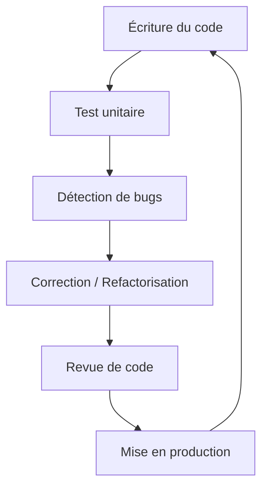

# Séance 1 – Introduction à l’optimisation et à la sécurité

## Partie 1 – Qu’est-ce qu’un code optimisé ?

### 3. Maintenabilité : facilité de modification, d'évolution et de débogage

---

### Introduction

La maintenabilité d'un code désigne sa capacité à être facilement modifié, amélioré et corrigé. Un code maintenable réduit le coût et le temps nécessaire pour faire évoluer un logiciel ou corriger des bugs. La maintenabilité est une composante essentielle de la qualité du logiciel et impacte directement la productivité des développeurs.

---

### A. Facilité de modification et d'évolution

#### 1. Modularité et découpage clair

- Diviser le code en modules/fonctions/classes cohérents et indépendants favorise la réutilisation et l’évolution isolée.
- Chaque module doit avoir une responsabilité unique (principe SRP - Single Responsibility Principle).

#### 2. Code lisible et documenté

- Un code bien lisible et correctement commenté facilite la compréhension nécessaire aux modifications.
- Utiliser des conventions de nommage claires (variables, fonctions) et tenir à jour les commentaires.

#### 3. Suivi des versions et gestion des dépendances

- Utiliser des outils de gestion de version (Git) pour suivre les modifications et permettre un retour en arrière en cas de problème.
- Documenter clairement les bibliothèques tierces et leur version pour éviter les conflits à l’évolution.

---

### B. Facilité de débogage

#### 1. Code clair et prévisible

- Le code doit être simple avec un flux logique bien défini.
- Eviter la complexité inutile (boucles imbriquées excessivement, instructions conditionnelles trop multiples).

#### 2. Gestion des erreurs robuste

- Implémenter la gestion d’exceptions claire et exhaustive.
- Utiliser des logs précis, décrivant les erreurs et leur contexte.

#### 3. Outils de débogage

- Utiliser les IDE avec points d’arrêt, pas à pas.
- Intégrer tests unitaires et tests automatisés qui permettent de détecter rapidement les anomalies.

---

### C. Mesures concrètes pour améliorer la maintenabilité

- **Refactorisation** régulière pour nettoyer le code sans changer ses fonctionnalités.
- **Tests unitaires et d’intégration** : ils garantissent la non-régression lors des modifications.
- **Revue de code** entre pairs afin d’améliorer la qualité collective.
- **Documentation technique** à jour qui explique les architectures, modules et interfaces.

---

### Exemple concret

```python
# Mauvais exemple : fonction trop longue avec responsabilités multiples
def traiter_donnees(data):
    nettoyee = []
    for d in data:
        if d != None:
            nettoyee.append(d.strip().lower())
    moyenne = sum(map(len, nettoyee)) / len(nettoyee)
    if moyenne > 5:
        print("Données longues en moyenne")
    else:
        print("Données courtes en moyenne")

# Bon exemple : séparation des responsabilités
def nettoyer_donnees(data):
    return [d.strip().lower() for d in data if d is not None]

def calculer_longueur_moyenne(donnees):
    return sum(map(len, donnees)) / len(donnees)

def afficher_message_longueur(moyenne):
    if moyenne > 5:
        print("Données longues en moyenne")
    else:
        print("Données courtes en moyenne")

def traiter_donnees(donnees):
    nettoyee = nettoyer_donnees(donnees)
    moyenne = calculer_longueur_moyenne(nettoyee)
    afficher_message_longueur(moyenne)
```

Cette séparation facilite les corrections futures, les tests unitaires de chaque fonction, et améliore la compréhension globale.

---

### Diagramme Mermaid – cycle de maintien du code



Ce diagramme illustre l’approche itérative qui permet d’améliorer la maintenabilité en intégrant tests et revues avant chaque mise en production.

---

### Références

- Martin Fowler, *Refactoring: Improving the Design of Existing Code*, https://martinfowler.com/books/refactoring.html
- Microsoft Docs, *Maintainable code: Principles and practices*, https://docs.microsoft.com/en-us/dotnet/standard/design-guidelines/
- IBM Developer, *The importance of maintainability in code*, https://developer.ibm.com/articles/maintainable-code/
- Atlassian Git Tutorial, *Version Control and Collaboration*, https://www.atlassian.com/git/tutorials

---

### Conclusion

Un code maintenable s’appuie sur la modularité, la clarté, la gestion rigoureuse des erreurs ainsi que sur des outils et processus adaptés. Il facilite non seulement les corrections et évolutions, mais aussi le travail collaboratif et la performance globale du projet logiciel. Appliquer ces principes réduit les risques d’erreurs et optimise les cycles de développement.