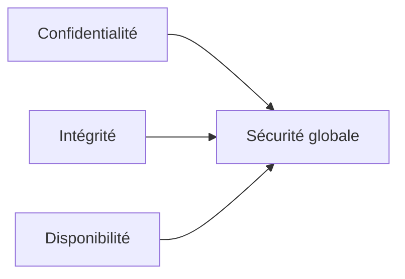

# Séance 1 – Introduction à l’optimisation et à la sécurité

## Partie 2 – Qu’est-ce qu’un code sécurisé ?

### 1. Principes CIA : Confidentialité, Intégrité, Disponibilité

---

### Introduction

La sécurité d’un système informatique repose fondamentalement sur trois piliers connus sous l’acronyme **CIA** : **Confidentialité, Intégrité, Disponibilité**. Ces principes guident la conception, le développement et la gestion des applications sécurisées.

---

### A. Confidentialité

La confidentialité garantit que les données ne sont accessibles qu’aux personnes ou systèmes autorisés.

- Protéger les données sensibles contre toute divulgation non autorisée.
- Techniques courantes :
  - **Chiffrement** des données en transit (TLS, HTTPS) et au repos (cryptage des bases de données).
  - Gestion stricte des droits d’accès (authentification forte, autorisations précises).
  - Masquage ou anonymisation des données sensibles.
  
**Exemple :** Le chiffrement des mots de passe dans une base de données ne stocke jamais le mot de passe en clair, mais utilise des fonctions de hachage sécurisées (bcrypt, Argon2).

---

### B. Intégrité

L’intégrité s’assure que les données n’ont pas été altérées de manière non autorisée pendant leur stockage ou leur transmission.

- Assurer que l’information est complète, exacte et fiable.
- Vérification par des mécanismes comme :
  - **Hashing** (SHA-256, SHA-3) pour détecter toute modification.
  - **Signatures numériques** assurant qu’un message n’a pas été modifié.
  - Contrôle d’accès et journalisation des modifications.

**Exemple :** Lors du téléchargement d’un fichier, la vérification du hash SHA-256 garantit que le fichier reçu est identique à la source.

---

### C. Disponibilité

La disponibilité garantit que les systèmes et données sont accessibles et opérationnels lorsque les utilisateurs autorisés en ont besoin.

- Prévention des pannes, attaques DDoS, erreurs humaines.
- Solutions :
  - **Redondance** (serveurs, bases de données répliquées).
  - **Sauvegardes régulières** et plans de reprise d’activité (disaster recovery).
  - Surveillance continue et alertes.
  
**Exemple :** Un site web de banque met en place des serveurs en cluster pour assurer une disponibilité 24/7 même en cas de panne d’un serveur.

---

### Diagramme Mermaid – Les 3 Piliers du modèle CIA

Ce diagramme illustre que la sécurité est l'intersection de la confidentialité, l'intégrité et la disponibilité.

---

### Synthèse avec exemples

| Principe        | Définition                                  | Exemple pratique                          |
|-----------------|---------------------------------------------|------------------------------------------|
| Confidentialité | Restreindre l’accès aux données              | Chiffrement TLS pour les échanges réseau |
| Intégrité       | Garantir que les données ne sont pas modifiées | Vérification par hash SHA-256            |
| Disponibilité   | Assurer l’accès continu aux services          | Serveurs redondants et sauvegardes       |

---

### Références

- OWASP, *CIA Triad*, https://owasp.org/www-community/controls/CIA_Triad
- NIST, *Security and Privacy Controls for Information Systems and Organizations*, https://nvlpubs.nist.gov/nistpubs/SpecialPublications/NIST.SP.800-53r5.pdf
- Cloudflare, *Understanding the CIA Triad*, https://www.cloudflare.com/learning/security/glossary/cia-triad/
- Microsoft Docs, *Security Fundamentals*, https://learn.microsoft.com/en-us/security/

---

### Conclusion

Le modèle CIA fournit un cadre simple et efficace pour concevoir des codes et systèmes sécurisés. En protégeant la confidentialité, en assurant l’intégrité et en garantissant la disponibilité, les développeurs peuvent construire des solutions robustes face aux menaces actuelles. Appliquer ces principes au cœur du développement aide à prévenir de nombreuses vulnérabilités.