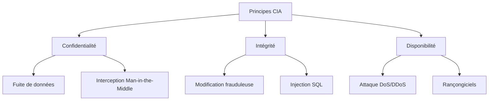

# Séance 1 – Introduction à l’optimisation et à la sécurité

## Partie 2 – Qu’est-ce qu’un code sécurisé ?

### 2. Exemples concrets d'atteintes aux principes CIA

---

### Introduction

Les principes **Confidentialité, Intégrité et Disponibilité (CIA)** définissent les objectifs fondamentaux de la sécurité informatique. Pourtant, des failles dans les systèmes et le code exposent régulièrement ces principes à des attaques et compromissions. Voici des exemples concrets permettant d’illustrer les types d’atteintes pouvant survenir.

---

### A. Atteintes à la Confidentialité

#### 1. Fuite de données (Data Leak)

- **Description** : Des données sensibles sont exposées ou accessibles à des tiers non autorisés.
- **Exemple concret** : En 2021, la faille chez Facebook a exposé des données personnelles de plus de 500 millions d’utilisateurs accessibles sur Internet en clair ([Source](https://www.nbcnews.com/tech/internet/500-million-facebook-users-records-leaked-online-n1261530)).
- **Technique mise en cause** : Faible contrôle des accès, absence de chiffrement, vulnérabilité d’injection (SQL Injection).

#### 2. Interception de données en transit (Man-in-the-Middle)

- **Description** : Un attaquant intercepte les communications entre deux parties sans qu’elles le sachent.
- **Exemple** : Attaques sur les réseaux Wi-Fi publics non sécurisés où les données ne sont pas chiffrées.
- **Protection** : Usage obligatoire de TLS/SSL.

---

### B. Atteintes à l’Intégrité

#### 1. Modification frauduleuse des données

- **Description** : Une donnée est modifiée illégalement, altérant sa fiabilité.
- **Exemple** : Attaque de type « defacement » de sites web où les contenus sont remplacés par des messages frauduleux ou malveillants.
- **Conséquence** : Perte de confiance, propagation possible de malwares.

#### 2. Injection SQL

- **Description** : L'injection de code malveillant dans une requête SQL manipule ou corrompt les données.
- **Exemple** : Extraction ou modification non autorisée des données sensibles dans une base de données.
  
```sql
-- Requête vulnérable
SELECT * FROM users WHERE username = 'admin' AND password = 'password' OR '1' = '1';

-- Injection malveillante
' OR '1'='1
```

Cette injection force la requête à toujours renvoyer vrai, donnant accès à des données protégées.

---

### C. Atteintes à la Disponibilité

#### 1. Attaque par Déni de Service (DoS/DDoS)

- **Description** : Le service est saturé par un trafic massif et devient indisponible pour les utilisateurs légitimes.
- **Exemple** : En 2016, l’attaque DDoS contre Dyn DNS a paralysé des dizaines de milliers de sites populaires (Netflix, Twitter) ([Source](https://www.wired.com/2016/10/internet-outage-ddos-dyn/)).
- **Protection** : Mise en place de solutions anti-DDoS et architecture redondante.

#### 2. Suppression ou corruption des données critiques

- **Description** : Des données stockées sont effacées ou altérées, empêchant l’accès au service.
- **Exemple** : Rançongiciels (ransomware) qui chiffrent les fichiers et réclament une rançon.
- **Stratégie de défense** : Sauvegardes régulières et plans de reprise d’activité.

---

### Diagramme Mermaid – Typologie des atteintes au modèle CIA



---

### Synthèse

| Principe       | Exemple d’attaque                  | Impact principal                  | Protection recommandée                    |
|----------------|----------------------------------|---------------------------------|------------------------------------------|
| Confidentialité| Fuite de données Facebook 2021   | Divulgation massive d’infos     | Contrôle d’accès, chiffrement            |
| Intégrité      | Injection SQL                    | Altération des données          | Validation des entrées, requêtes paramétrées |
| Disponibilité  | Attaque DDoS sur Dyn DNS         | Indisponibilité temporaire      | Anti-DDoS, redondance infrastructure      |

---

### Références

- OWASP, *Top 10 Security Risks*, https://owasp.org/www-project-top-ten/
- IBM Security, *Data breach examples and lessons*, https://www.ibm.com/security/data-breach
- Krebs on Security, *2016 Dyn DDoS Attack Analysis*, https://krebsonsecurity.com/2016/10/ddos-on-dns-provider-dyn-impacts-twitter-spotify/
- CNIL, *Sécurisation des données personnelles*, https://www.cnil.fr/fr/securiser-les-donnees-personnelles

---

### Conclusion

Les atteintes aux principes CIA se manifestent par des fuites, modifications non autorisées, ou interruptions d’accès. Comprendre ces exemples concrets aide à prioriser les mesures de sécurité adaptées : contrôle des accès, validation et chiffrement pour la confidentialité et l’intégrité, et architecture résiliente pour la disponibilité.