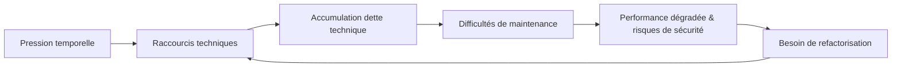

# Séance 1 – Introduction à l’optimisation et à la sécurité  

## Partie 3 – Notion de dette technique et d’impact sur la performance / sécurité  

### 1. Définition et causes de la dette technique

---

### Introduction

La **dette technique** désigne l’accumulation de compromis faits lors du développement logiciel qui facilitent la livraison rapide à court terme, mais qui engendrent des coûts plus élevés à long terme en termes de maintenance, performance, et sécurité.

---

### A. Définition de la dette technique

- Concept introduit par Ward Cunningham, la dette technique est une métaphore qui compare des raccourcis techniques à une dette financière.  
- Comme une dette, elle doit être "remboursée" sous forme de refactorisations ou corrections.  
- Si elle n'est pas remboursée, elle s’accumule, alourdit le code et ralentit les évolutions futures.

---

### B. Causes principales de la dette technique

1. **Pression temporelle et livraisons rapides**  
   - Priorisation de la vitesse sur la qualité.
   - Sacrifices sur les bonnes pratiques, tests, documentation.

2. **Absence ou mauvaise définition des standards de développement**  
   - Incohérences dans le code (naming, architecture, modularité).  
   - Difficulté à maintenir ou étendre.

3. **Manque de compétence ou de connaissance**  
   - Code écrit sans maîtrise complète des technologies employées.  
   - Mauvaise implémentation de fonctionnalités.

4. **Évolution ou modification non planifiée**  
   - Ajout rapide de features sans révision structurelle.  
   - Endettement involontaire lié aux corrections urgentes (bugs, patchs).

5. **Manque d’automatisation des tests et intégration continue**  
   - Détection tardive des erreurs.  
   - Déploiements risqués et fréquent rollback.

---

### C. Impact sur la performance et la sécurité

| Aspect       | Conséquence fréquente liée à la dette technique                                     |
|--------------|------------------------------------------------------------------------------------|
| Performance  | Code redondant, algorithmes inefficaces, consommation excessive des ressources     |
| Sécurité     | Failles laissées ouvertes, mauvaise gestion des accès, absence de mises à jour     |

---

### Exemples concrets

1. **Code spaghetti**  
Un code non structuré rapidement développé, difficile à comprendre et modifier. Résultat : augmentation du temps d’exécution et risque accru d’erreurs.

2. **Absence de validation des entrées**  
Une validation défaillante provoque des failles de sécurité (ex: injection SQL).

3. **Correction rapide sans tests**  
Introduit de nouveaux bugs ou failles qui s’ajoutent à la dette.

---

### Diagramme Mermaid – Cycle de la dette technique

Cette boucle illustre comment la dette technique s’accumule si elle n’est pas régulée.

---

### Références

- Atlassian, *What is Technical Debt?*, https://www.atlassian.com/software/jira/guides/expand-jira/technical-debt
- Sonatype, *What Causes Technical Debt?*, https://www.sonatype.com/technical-debt
- IEEE, *Managing Technical Debt in Software Development*, https://ieeexplore.ieee.org/document/8253171
- ThoughtWorks, *The Impact of Technical Debt on Performance and Security*, https://www.thoughtworks.com/insights/blog/technical-debt

---

### Conclusion

La dette technique naît souvent de compromis à court terme dans le développement. Identifier ses causes permet d’adopter des bonnes pratiques (tests, documentation, refactorisation régulière) pour limiter son accumulation. Sa gestion est clé pour maintenir un code performant et sécurisé sur le long terme.