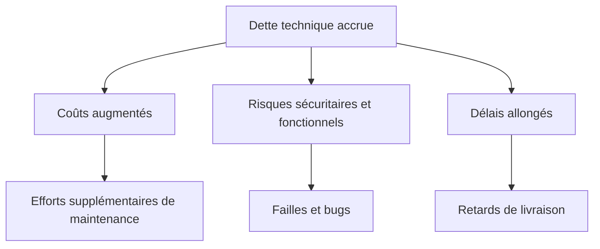

# Séance 1 – Introduction à l’optimisation et à la sécurité  

## Partie 3 – Notion de dette technique et d’impact sur la performance / sécurité  

### 2. Conséquences sur le projet : coûts, risques, délais

---

### Introduction

La dette technique influence directement la trajectoire d’un projet logiciel. Ses conséquences touchent les **coûts**, les **délais** et les **risques**, impactant la viabilité et la qualité du produit.

---

### A. Coûts accrus

- **Maintenance lourde** : Corriger un code endetté est plus coûteux car il est souvent complexe, peu documenté et difficile à modifier.  
- **Efforts croissants** : Chaque nouvelle fonctionnalité devient plus chère à développer en raison de la complexité existante.  
- **Coût indirect** : Augmentation des bugs, incidents en production, support technique gonflent le budget.

**Chiffres clés** : Selon une étude de Stripe (2020), 42 % du temps de développement est consacré à gérer la dette technique ([Source](https://stripe.com/blog/state-of-software-development)).

---

### B. Risques accrus

- **Sécurité compromise** : La dette technique engendre des failles de sécurité par exemple, via des patchs précaires ou absence de mises à jour.  
- **Perte de qualité fonctionnelle** : Bugs fréquents, régressions dues à un code fragile et non couvert par les tests.  
- **Perte de confiance utilisateur** : Disponibilité et performances détériorées impactent l’image.

**Exemple** : La faille Heartbleed en 2014 issue d’une mauvaise gestion du code OpenSSL, liée au manque de maintenance rigoureuse ([Source](https://heartbleed.com/)).

---

### C. Délais allongés

- **Complexification du développement** : La courbe d’apprentissage s’allonge et la compréhension du code demande plus de temps.  
- **Tests et corrections répétitives** : L’absence de structure claire impose plus d’étapes de vérification pour éviter les effets en cascade.  
- **Bloquage des déploiements** : Risque accru de régressions obligeant à retarder la mise en production.

---

### D. Exemple chiffré et illustré

Une équipe commence un projet avec un endettement technique faible. Au fil du temps, sans refactorisation, les coûts et délais augmentent comme suit :

| Phase          | Dette technique accumulée | Coût de modification (%) | Délai de livraison (%) |
|----------------|--------------------------|-------------------------|-----------------------|
| Initiale       | Faible                   | 100                     | 100                   |
| Après 6 mois   | Moyenne                  | 130                     | 120                   |
| Après 12 mois  | Élevée                   | 170                     | 150                   |

---

### Diagramme Mermaid – Impact de la dette technique sur coûts, risques, délais

---

### Synthèse

| Dimension | Impact de la dette technique                                   | Solution courante                         |
|-----------|----------------------------------------------------------------|------------------------------------------|
| Coûts     | Augmentation continue des coûts de maintenance et développement | Refactorisation régulière, automatisation|
| Risques   | Augmentation des failles de sécurité et dysfonctionnements    | Tests unitaires, revue de code, mises à jour|
| Délais    | Allongement des cycles de livraison, retards fréquents        | Processus d’intégration continue, gestion agile|

---

### Références

- Stripe, *The State of Software Development 2020*, https://stripe.com/blog/state-of-software-development  
- OWASP, *Technical Debt and Security*, https://owasp.org/www-community/Threat_Modeling  
- Heartbleed Bug Report, https://heartbleed.com/  
- IEEE, *Managing Technical Debt in Software Projects*, https://ieeexplore.ieee.org/document/8253171  

---

### Conclusion

La dette technique génère une augmentation des coûts, des risques accrus en sécurité et des délais plus longs, affectant la réussite globale d’un projet. L’anticiper et la gérer par des bonnes pratiques préserve qualité, sécurité, et respect des échéances.