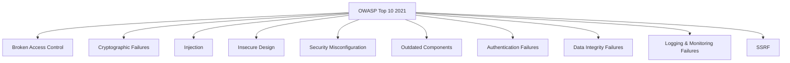

# Séance 1 – Introduction à l’optimisation et à la sécurité  

## Partie 4 – Panorama des failles courantes (OWASP Top 10)  

### 1. Présentation détaillée des 10 catégories de failles les plus critiques

---

### Introduction

L’**OWASP Top 10** est une liste actualisée régulièrement qui recense les dix failles de sécurité les plus critiques dans les applications web. Connaître ces vulnérabilités permet d’adopter des pratiques correctrices et préventives efficaces.

---

### Les 10 failles OWASP 2021 en détail

| Numéro | Failles (2021)                         | Description succincte                                    | Exemple concret                              |
|--------|--------------------------------------|---------------------------------------------------------|----------------------------------------------|
| A01    | **Broken Access Control**             | Contrôle d’accès insuffisant permettant actions illégitimes | Un utilisateur standard accédant à une page admin via modification d’URL |
| A02    | **Cryptographic Failures**            | Mauvaise gestion du chiffrement et des données sensibles | Stockage de mots de passe en clair ou avec un algorithme faible          |
| A03    | **Injection**                        | Inclusion de code malveillant via des entrées non filtrées | Injection SQL via un formulaire non sécurisé                              |
| A04    | **Insecure Design**                  | Absence de contrôles de sécurité dès la conception        | Utilisation d’authentification faible ou absence de validation des entrées |
| A05    | **Security Misconfiguration**        | Erreurs dans la configuration des serveurs, frameworks   | Serveur laissant ouvertes des interfaces d’administration non protégées  |
| A06    | **Vulnerable and Outdated Components**| Utilisation de bibliothèques ou composants obsolètes      | Version non patchée d’une librairie avec une faille connue                |
| A07    | **Identification and Authentication Failures** | Failles dans le système d’authentification                | Absence de limitation de tentatives de connexion (brute force possible)   |
| A08    | **Software and Data Integrity Failures** | Manque de contrôles garantissant l’intégrité du code et des données | Déploiement sans signatures vérifiées ou mise à jour non sécurisée        |
| A09    | **Security Logging and Monitoring Failures** | Absence de journalisation et détection d’intrusion         | L’absence d’alertes en cas de tentatives d’attaque                       |
| A10    | **Server-Side Request Forgery (SSRF)** | Le serveur est forcé de faire des requêtes non désirées     | Envoi de requêtes internes via une URL malveillante envoyée par l’utilisateur |

---

### Exemples détaillés

#### A01 – Broken Access Control

```http
GET /admin/dashboard HTTP/1.1
Host: example.com
Cookie: sessionId=standardUserSession
```
Un utilisateur modifiant simplement l’URL pour accéder à des pages privées non autorisées illustre ce problème.

#### A03 – Injection SQL

```sql
-- Requête vulnérable
SELECT * FROM users WHERE username = 'admin' AND password = 'password';

-- Injection malveillante
' OR '1'='1'; --
```
Cette injection contourne la vérification d’authentification.

---

### Diagramme Mermaid – Catégories OWASP Top 10



---

### Mesures Correctives et Bonnes Pratiques

- **Validation stricte des entrées** pour éviter les injections.  
- **Contrôle d’accès robuste** par rôles et permissions précises.  
- **Utilisation de cryptographie éprouvée** pour protéger les données.  
- **Mise à jour régulière** des composants et bibliothèques.  
- **Journalisation et surveillance** en temps réel pour détection rapide des anomalies.  
- **Design sécurisé** dès la phase de conception (Security by Design).

---

### Références

- OWASP, *OWASP Top 10 – 2021*, https://owasp.org/Top10/  
- NIST, *Guide to Application Security*, https://csrc.nist.gov/publications/detail/sp/800-218/final  
- Veracode, *OWASP Top 10: Explained with Examples*, https://www.veracode.com/security/owasp-top-10  
- SANS Institute, *Top 10 Web Application Security Risks*, https://www.sans.org/white-papers/404/  

---

### Conclusion

Le respect des recommandations OWASP Top 10 constitue une première ligne de défense fondamentale. Une bonne connaissance de ces failles permet d’écrire un code plus sûr, prévenant ainsi les vulnérabilités majeures qui exposent souvent les applications à des risques importants.