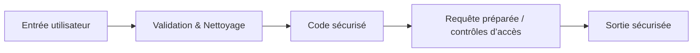

# Séance 1 – Introduction à l’optimisation et à la sécurité  

## Partie 4 – Panorama des failles courantes (OWASP Top 10)  

### 2. Exemples simples pour PHP, Java et Node.js  

---

### Introduction  

La compréhension des failles OWASP se consolide par la mise en pratique à travers des exemples concrets en plusieurs langages de programmation. Ci-dessous, des illustrations simples dans PHP, Java et Node.js pour détecter et corriger les vulnérabilités courantes.  

---

### A. Exemple en PHP : Injection SQL (A03 – Injection)  

**Code vulnérable :**

```php
<?php
$username = $_POST['username'];
$password = $_POST['password'];

$query = "SELECT * FROM users WHERE username = '$username' AND password = '$password'";
$result = mysqli_query($conn, $query);
?>
```

**Problème :** Les variables insérées directement dans la requête SQL exposent à une injection (ex: `username = ' OR '1'='1`).

**Correction avec requêtes préparées :**

```php
<?php
$stmt = $conn->prepare("SELECT * FROM users WHERE username = ? AND password = ?");
$stmt->bind_param("ss", $username, $password);
$stmt->execute();
$result = $stmt->get_result();
?>
```

---

### B. Exemple en Java : Broken Access Control (A01)  

**Code vulnérable :**

```java
// Contrôle d'accès insuffisant
String role = request.getParameter("role"); // récupéré de la requête HTTP
if(role.equals("admin")){
    // accès aux données sensibles
}
```

**Problème :** L'utilisateur peut modifier la requête pour s’attribuer un rôle administrateur.

**Correction :**

- Valider le rôle côté serveur avec les données authentifiées du token ou session.
- Ne pas s’appuyer sur les données utilisateur non sécurisées.

---

### C. Exemple en Node.js : Cross-Site Scripting (XSS) (A03 / A04)

**Code vulnérable :**

```javascript
app.get('/greet', (req, res) => {
    const name = req.query.name;
    res.send(`<h1>Hello, ${name}</h1>`);
});
```

**Problème :** Si un attaquant fournit `<script>alert('XSS')</script>` comme nom, le script sera exécuté dans le navigateur.

**Correction avec échappement des caractères :**

```javascript
const escapeHTML = (unsafe) => {
    return unsafe.replace(/[&<>"']/g, (match) => {
        const escapeMap = {
            '&': '&amp;',
            '<': '&lt;',
            '>': '&gt;',
            '"': '&quot;',
            "'": '&#39;'
        };
        return escapeMap[match];
    });
};

app.get('/greet', (req, res) => {
    const name = escapeHTML(req.query.name);
    res.send(`<h1>Hello, ${name}</h1>`);
});
```

Ou utiliser des moteurs de template qui intègrent automatiquement l’échappement (ex: EJS, Pug).

---

### Diagramme Mermaid – Processus de gestion des failles dans le code



---

### Synthèse  

| Langage | Failles illustrées         | Correction clé                             |
|---------|---------------------------|-------------------------------------------|
| PHP     | Injection SQL             | Utiliser des requêtes préparées           |
| Java    | Broken Access Control     | Valider strictement rôle et autorisation  |
| Node.js | Cross-Site Scripting (XSS)| Échapper ou filtrer les données en sortie |

---

### Références  

- OWASP, *SQL Injection*, https://owasp.org/www-community/attacks/SQL_Injection  
- OWASP, *Access Control*, https://owasp.org/www-project-top-ten/2021/A01_2021-Broken_Access_Control.html  
- OWASP, *Cross Site Scripting (XSS)*, https://owasp.org/www-community/attacks/xss/  
- Mozilla MDN, *Preventing XSS*, https://developer.mozilla.org/en-US/docs/Web/Security/Types_of_attacks/Cross-site_scripting  
- Node.js Security Handbook, https://nodejs.dev/en/security/  

---

### Conclusion  

Des exemples simples dans PHP, Java et Node.js démontrent l’importance d’intégrer rapidement des mesures de sécurité élémentaires comme la validation des entrées, le contrôle d’accès solide et l’échappement des sorties. Ces pratiques empêchement l’exploitation des failles OWASP les plus courantes.