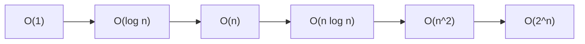

# Séance 2 – Optimisation des performances côté backend  

## Partie 1 – Complexité algorithmique : rappel rapide (O(n), O(log n), O(n²)…)  

### 1. Revue des notations asymptotiques et leur signification  

---

### Introduction  

La complexité algorithmique mesure l’efficacité d’un algorithme en termes de ressources utilisées (temps, mémoire) en fonction de la taille des données d’entrée, notée \(n\). Les **notations asymptotiques** permettent d’évaluer cette croissance, indépendamment des constantes et des détails d’implémentation.

---

### A. Les principales notations asymptotiques

| Notation                 | Description                              | Exemple d'algorithme                  |
|--------------------------|----------------------------------------|-------------------------------------|
| \(O(1)\) (constante)     | Temps d’exécution constant, indépendant de \(n\) | Accès à un élément de tableau       |
| \(O(\log n)\) (logarithmique) | Temps de croissance proportionnel au logarithme de \(n\) | Recherche binaire                   |
| \(O(n)\) (linéaire)      | Temps de croissance proportionnel à \(n\) | Parcours d’un tableau               |
| \(O(n \log n)\)          | Combiné linéaire-logarithmique          | Tri rapide (Quicksort), Merge sort |
| \(O(n^2)\) (quadratique) | Temps proportionnel au carré de \(n\)   | Tri à bulles                      |
| \(O(2^n)\) (exponentielle) | Temps qui double à chaque ajout d’élément | Problèmes NP-complets simples (ex: Sous-ensembles) |

---

### B. Signification et impact sur la performance backend

- **\(O(1)\)** : Idéal, l’opération s’exécute instantanément quel que soit \(n\).  
- **\(O(\log n)\)** : Croissance lente, permet de traiter efficacement de grandes données.  
- **\(O(n)\)** : Temps proportionnel à la taille des données, acceptable pour des volumes moyens.  
- **\(O(n \log n)\)** : Optimal pour de nombreux algorithmes de tri.  
- **Au-delà de \(O(n^2)\)** : Traitement peu efficace, à éviter sauf pour de très petites données.

---

### C. Exemples concrets

#### Recherche Binaire \(O(\log n)\)

```python
def recherche_binaire(arr, cible):
    gauche, droite = 0, len(arr) - 1
    while gauche <= droite:
        milieu = (gauche + droite) // 2
        if arr[milieu] == cible:
            return milieu
        elif arr[milieu] < cible:
            gauche = milieu + 1
        else:
            droite = milieu - 1
    return -1
```

Sur une liste triée de taille 1 million, une recherche binaire prend environ 20 comparaisons, alors qu’une recherche linéaire peut en demander jusqu’à 1 million.

#### Tri à bulles \(O(n^2)\)

```python
def tri_bulles(arr):
    n = len(arr)
    for i in range(n):
        for j in range(0, n - i - 1):
            if arr[j] > arr[j + 1]:
                arr[j], arr[j + 1] = arr[j + 1], arr[j]
```

Ce tri devient rapidement impraticable dès quelques milliers d’éléments.

---

### D. Représentation graphique des complexités



Cette représentation montre la progression très rapide du coût en termes de ressources à mesure que la complexité monte.

---

### Références  

- MIT OpenCourseWare, *Introduction to Algorithms*, https://ocw.mit.edu/courses/6-006-introduction-to-algorithms-fall-2011/  
- GeeksforGeeks, *Asymptotic Notations*, https://www.geeksforgeeks.org/asymptotic-notations/  
- Big-O Cheat Sheet, https://www.bigocheatsheet.com/  
- Coursera, *Algorithmic Toolbox*, https://www.coursera.org/learn/algorithmic-toolbox  

---

### Conclusion  

Comprendre les notations asymptotiques permet d’anticiper la scalabilité des algorithmes dans un backend et d’optimiser les traitements selon la taille des données. Favoriser les algorithmes à basse complexité, particulièrement logarithmique ou linéaire, garantit de meilleures performances et réactivité.