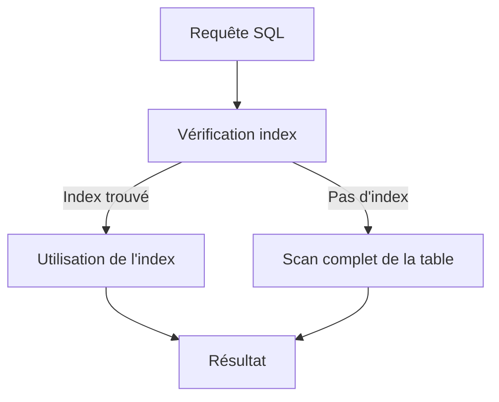

# Séance 2 – Optimisation des performances côté backend  

## Partie 2 – Requêtes SQL optimisées (indexes, SELECT ciblés, pagination)  

### 1. Création et gestion des indexes pour accélérer les recherches  

---

### Introduction  

Les index en base de données relationnelle sont des structures spécialisées qui permettent d’accélérer considérablement les opérations de lecture (recherche, tri) en évitant les scans complets des tables. Bien utilisés, ils améliorent la réactivité des requêtes et réduisent la charge serveur.

---

### A. Qu’est-ce qu’un index ?  

Un index est un arbre de données (souvent un B-Tree ou variant) qui maintient un ordonnancement des valeurs d’une ou plusieurs colonnes et facilite l’accès direct aux lignes correspondantes.  

| Sans index          | Scan complet de la table (coût élevé)   |
|---------------------|-----------------------------------------|
| Avec index           | Recherche ciblée en temps logarithmique |

---

### B. Types d’index courants  

| Type d’index   | Description                                            | Usage principal                         |
|----------------|--------------------------------------------------------|---------------------------------------|
| Index B-Tree   | Structure équilibrée pour recherches égalité/intervalle | Requêtes avec WHERE, ORDER BY         |
| Index Hash     | Accès rapide pour égalité stricte                      | Requêtes d’égalité uniquement         |
| Index Full-Text | Recherche de mots dans des textes longs                 | Moteurs de recherche textuels         |
| Index Composite | Index sur plusieurs colonnes                            | Optimise les requêtes combinant colonnes |

---

### C. Création d’un index en SQL  

```sql
CREATE INDEX idx_nom_colonne ON table (nom_colonne);
```

**Exemple :** accélérer une recherche sur la colonne `email` de la table `users`  

```sql
CREATE INDEX idx_users_email ON users (email);
```

---

### D. Impact sur les requêtes  

**Requête sans index :**

```sql
SELECT * FROM users WHERE email = 'alice@example.com';
```

- La base scanne toute la table, temps proportionnel à la taille.

**Requête avec index :**

- L’index permet une recherche efficace, temps proche de \(O(\log n)\).

---

### E. Gestion des indexes  

- **Veiller à ne pas sur-indexer :** trop d’index ralentit les opérations d’écriture (`INSERT`, `UPDATE`, `DELETE`).  
- **Supprimer les indexes inutilisés :**

```sql
DROP INDEX idx_users_email ON users;
```

- **Analyser les plans d’exécution** avec `EXPLAIN` ou `EXPLAIN ANALYZE` pour vérifier la prise en compte des indexes.

---

### F. Exemples pratiques et conseils

| Situation                             | Recommandation                      |
|-------------------------------------|-----------------------------------|
| Recherche fréquente sur une colonne | Créer un index sur cette colonne  |
| Tri répété par une colonne           | Index pour optimiser ORDER BY     |
| Requêtes combinant plusieurs colonnes| Index composite (ex: `(col1, col2)`)|

---

### G. Diagramme Mermaid – Cycle d’utilisation d’un index



---

### Références  

- PostgreSQL Documentation – Indexes, https://www.postgresql.org/docs/current/indexes.html  
- MySQL Documentation – Optimization with Indexes, https://dev.mysql.com/doc/refman/8.0/en/mysql-indexes.html  
- Oracle Docs – Indexing, https://docs.oracle.com/en/database/oracle/oracle-database/19/tgsql/indexes.html  
- Use The Index, Luke!, https://use-the-index-luke.com/  

---

### Conclusion  

Les indexes sont des outils puissants pour optimiser les performances des requêtes SQL en réduisant considérablement la durée des recherches. Leur création et gestion stratégique, accompagnées d’une analyse régulière, maximisent leur efficacité tout en limitant les impacts négatifs sur les opérations d’écriture.