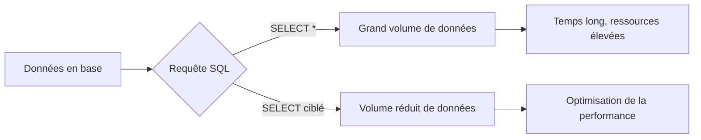

# Séance 2 – Optimisation des performances côté backend  

## Partie 2 – Requêtes SQL optimisées (indexes, SELECT ciblés, pagination)  

### 2. Utilisation de SELECT ciblés pour ne récupérer que les données nécessaires  

---

### Introduction  

Récupérer uniquement les données nécessaires avec un **SELECT ciblé** permet d’économiser des ressources serveur, d’accélérer le temps de traitement et de réduire la quantité de données transférées au client.  

L’utilisation de `SELECT *` non filtré est souvent source de surconsommation inutile.  

---

### A. Limiter les colonnes retournées  

Au lieu de :  
```sql
SELECT * FROM users;
```
Privilégier :  
```sql
SELECT id, username, email FROM users;
```

- Réduit le volume de données transférées.  
- Diminue la charge en traitement pour le serveur et client.  
- Facilite la maintenance en rendant explicite les données nécessaires.

---

### B. Cas pratique : récupération de profils utilisateurs  

**Exemple non optimisé :**  

```sql
SELECT * FROM users WHERE status = 'active';
```

Ici, on récupère toutes les informations, même celles inutiles (mot de passe, date création, etc.).  

**Exemple optimisé :**  

```sql
SELECT id, username, email, last_login FROM users WHERE status = 'active';
```

Cette requête évite d’exposer des données sensibles et réduit la quantité transférée.

---

### C. Avantages en termes de performance  

- **Moins de lecture disque** si les colonnes sont indexées (clustered index).  
- **Moins de charge réseau** avec un volume de données réduit.  
- **Traitement plus rapide** par le moteur de base de données et les applications clientes.  

---

### D. Attention aux colonnes calculées et aux jointures  

Lors de requêtes complexes avec jointures ou colonnes calculées, éviter également de récupérer des colonnes inutiles pour minimiser la charge.  

---

### E. Diagramme Mermaid – Flux de requête optimisée



---

### F. Exemples concrets  

| Requête                                            | Impact                                           |
|---------------------------------------------------|-------------------------------------------------|
| `SELECT * FROM products WHERE price > 100;`       | Récupère toutes les colonnes, surcharge réseau  |
| `SELECT id, name, price FROM products WHERE price > 100;` | Récupère uniquement l’essentiel, plus efficace |

---

### Références  

- PostgreSQL Documentation – SELECT, https://www.postgresql.org/docs/current/sql-select.html  
- MySQL Official Documentation – SELECT Syntax, https://dev.mysql.com/doc/refman/8.0/en/select.html  
- Use The Index Luke! – Non covering columns impact, https://use-the-index-luke.com/sql/covering-indexes/select-projection  
- SQL Performance Explained – Markus Winand, https://sql-performance-explained.com/  

---

### Conclusion  

Rester précis dans les colonnes sélectionnées garantit une gestion efficace des ressources en backend. Le SELECT ciblé favorise des applications plus rapides, sécurisées (en limitant l’exposition de données), et moins gourmandes en mémoire et en temps de traitement.