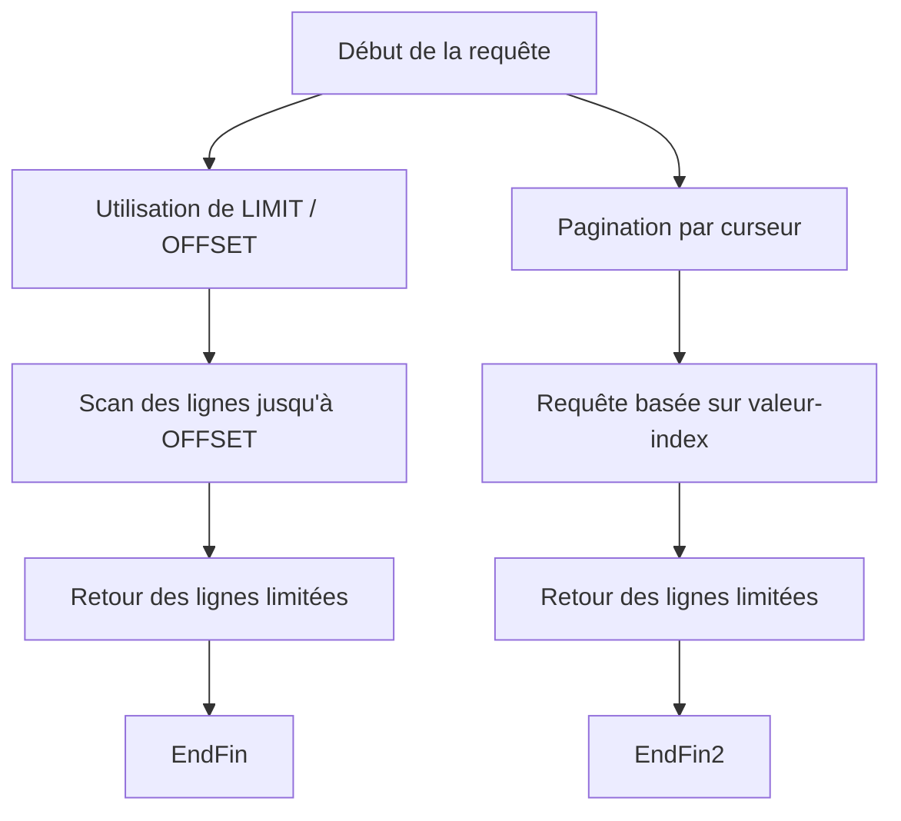

# Séance 2 – Optimisation des performances côté backend  

## Partie 2 – Requêtes SQL optimisées (indexes, SELECT ciblés, pagination)  

### 3. Implémentation de la pagination pour les grands jeux de résultats  

---

### Introduction  

Lorsque des requêtes retournent un grand nombre de lignes, récupérer toutes les données en une seule fois est inefficace et peut entraîner des temps de réponse élevés, une surcharge mémoire et une mauvaise expérience utilisateur. La **pagination** permet de découper les résultats en pages, fournissant ainsi des ensembles de données plus petits et plus maniables.  

---

### A. Principes de base de la pagination SQL  

La pagination consiste à limiter le nombre de résultats affichés et à naviguer entre différentes pages via des mécanismes SQL spécifiques.

- **LIMIT** : limite le nombre de résultats retournés.  
- **OFFSET** : saute un certain nombre de lignes.  

**Syntaxe classique :**

```sql
SELECT colonnes FROM table
ORDER BY colonne_tri
LIMIT nombre_de_lignes OFFSET décalage;
```

---

### B. Exemple simple  

Afficher la 3ème page avec 10 résultats par page :

```sql
SELECT id, nom, email FROM users
ORDER BY id
LIMIT 10 OFFSET 20;
```

- `OFFSET 20` saute les 20 premiers résultats (2 pages de 10 lignes).  
- `LIMIT 10` récupère les 10 résultats suivants pour la page courante.

---

### C. Remarques importantes  

- **Performance impactée par OFFSET** : Pour un OFFSET élevé, la base doit scanner et ignorer beaucoup de lignes, ce qui peut ralentir la requête.  
- **Ordre du tri** : Toujours utiliser un `ORDER BY` pour garantir un affichage cohérent et stable des pages.    

---

### D. Alternatives et optimisation  

#### 1. Pagination par curseur (keyset pagination)  

Au lieu d’OFFSET, on utilise une valeur de clé (ex: `id`) pour récupérer la page suivante, réduisant le coût.

```sql
SELECT id, nom, email FROM users
WHERE id > dernier_id_de_la_page_precedente
ORDER BY id
LIMIT 10;
```

- Plus rapide pour les pages éloignées du début.  
- Adapté aux applications avec données en temps réel.

---

### E. Diagramme Mermaid – Comparaison de pagination  



---

### F. Bonnes pratiques  

- Utiliser une pagination avec `LIMIT` et `OFFSET` pour petits volumes ou pages proches du début.  
- Privilégier la pagination par curseur quand la profondeur des pages est importante.  
- Optimiser la requête avec des indexes sur les colonnes utilisées dans `ORDER BY` et le filtre (ex: `id`).

---

### Références  

- PostgreSQL Documentation – LIMIT and OFFSET, https://www.postgresql.org/docs/current/queries-limit.html  
- MySQL Documentation – SELECT Syntax (LIMIT), https://dev.mysql.com/doc/refman/8.0/en/select.html  
- Use The Index, Luke! – Pagination, https://use-the-index-luke.com/sql/offset-fetch  
- Martin Fowler, *Keyset Pagination*, https://martinfowler.com/blog/paginating-forward/  

---

### Conclusion  

La pagination permet d’adapter les requêtes SQL aux contraintes de performance et d’expérience utilisateur en limitant les quantités de données retournées par page. Choisir la bonne méthode (LIMIT/OFFSET ou pagination par curseur) selon le contexte garantit une navigation fluide dans les grands jeux de données.