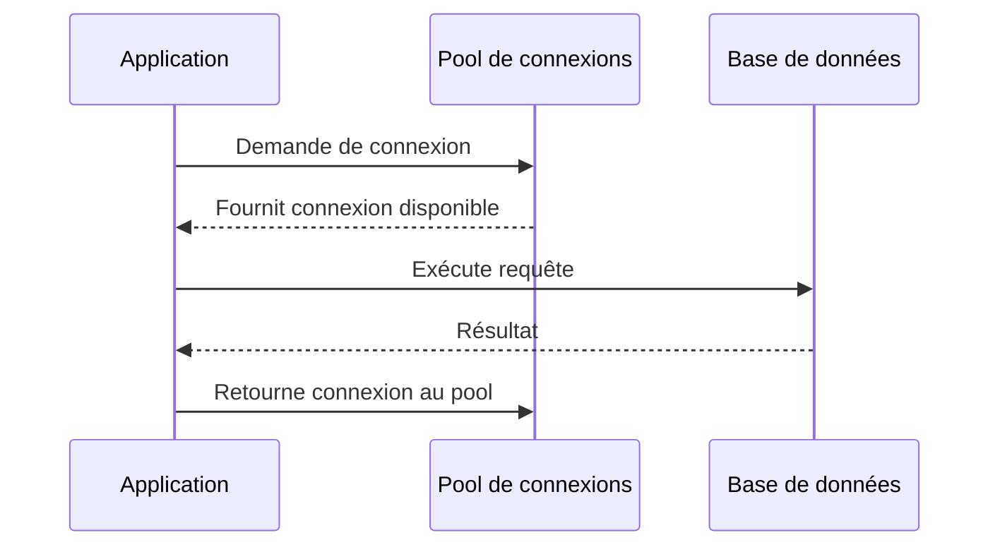

# Séance 2 – Optimisation des performances côté backend  

## Partie 3 – Gestion efficace des ressources (connexions DB, threads, cache)  

### 1. Pooling de connexions de base de données (Spring Boot DataSource, PHP PDO)  

---

### Introduction  

L'ouverture et la fermeture fréquentes des connexions à une base de données sont coûteuses en performances. Le **pooling de connexions** consiste à réutiliser un ensemble fixe de connexions ouvertes, réduisant la latence et la charge sur la base.  

---

### A. Fonctionnement du Pool de connexions  

Un pool garde un nombre limité de connexions actives prêtes à être utilisées par les requêtes entrantes. Lorsqu’une requête doit accéder à la base, elle emprunte une connexion disponible au pool, puis la retourne une fois l’opération terminée.  

**Avantages:**  
- Réduction du temps de création de connexion.  
- Gestion optimale du nombre maximum de connexions simultanées (évite la surcharge du SGBD).  
- Meilleur contrôle et surveillance des connexions.

---

### B. Pooling dans Spring Boot (Java)  

Spring Boot facilite la configuration du pool via des **DataSource** selon différents fournisseurs (HikariCP, Tomcat, etc.). Depuis Spring Boot 2.x, **HikariCP** est le pool par défaut, reconnu pour sa performance et sa légèreté.  

#### Exemple de configuration dans `application.properties` :

```properties
spring.datasource.url=jdbc:mysql://localhost:3306/mabd
spring.datasource.username=utilisateur
spring.datasource.password=motdepasse
spring.datasource.driver-class-name=com.mysql.cj.jdbc.Driver

spring.datasource.hikari.maximum-pool-size=10
spring.datasource.hikari.minimum-idle=5
spring.datasource.hikari.idle-timeout=30000
spring.datasource.hikari.max-lifetime=1800000
```

- `maximum-pool-size` : nombre maximal de connexions simultanées.  
- `minimum-idle` : nombre minimum de connexions inactives dans le pool.  
- `idle-timeout` : durée avant fermeture d’une connexion inactive.  
- `max-lifetime` : durée max d’une connexion avant d’être recyclée.

#### Exemple code (injection DataSource) :

```java
@Autowired
private DataSource dataSource;

public void testConnection() throws SQLException {
    try (Connection conn = dataSource.getConnection()) {
        System.out.println("Connexion récupérée : " + !conn.isClosed());
    }
}
```

---

### C. Pooling en PHP avec PDO  

En PHP, PDO ne gère pas le pooling nativement. Le pooling doit être assuré par l’architecture sous-jacente (ex: PHP-FPM, Serveurs Web, ou des outils tiers).

Cependant :  

- **Persistent connections** via PDO permettent de réutiliser une connexion entre plusieurs requêtes PHP.

#### Exemple PDO avec connexion persistante :

```php
$dsn = 'mysql:host=localhost;dbname=mabd;charset=utf8';
$options = [
    PDO::ATTR_PERSISTENT => true,
    PDO::ATTR_ERRMODE => PDO::ERRMODE_EXCEPTION
];

try {
    $pdo = new PDO($dsn, 'utilisateur', 'motdepasse', $options);
    echo "Connexion PDO persistante ouverte\n";
} catch (PDOException $e) {
    echo "Erreur : " . $e->getMessage();
}
```

- Le flag `ATTR_PERSISTENT` indique que la connexion doit être persistée au-delà de l’exécution du script, évitant son ouverture/fermeture répétitive.  
- Attention à bien gérer les connexions persistantes, car elles peuvent engendrer d’autres problèmes (verrouillage, consommation mémoire).

---

### D. Diagramme Mermaid – Schéma fonctionnement du Pooling  



---

### E. Bonnes pratiques  

- **Dimensionner le pool** en fonction de la charge estimée et des limites du SGBD.  
- **Surveiller la saturation** du pool via des outils de monitoring pour éviter les blocages.  
- **Recycler les connexions** périodiquement pour éviter les connexions mortes.  
- En PHP, privilégier les scripts courts et éviter le pooling natif complexe ; utiliser un système robuste (ex: serveurs persistent).  

---

### Références  

- Spring Boot Reference Guide – DataSource and HikariCP, https://docs.spring.io/spring-boot/docs/current/reference/htmlsingle/#boot-features-connect-to-production-database  
- PHP Manual – PDO Persistent Connections, https://www.php.net/manual/en/pdo.connections.php  
- Baeldung – Introduction to HikariCP, https://www.baeldung.com/spring-boot-hikaricp  
- Wikipedia – Connection Pool, https://en.wikipedia.org/wiki/Connection_pool  

---

### Conclusion  

Le pooling de connexions optimise l’utilisation des ressources bases de données en limitant les coûts d’ouverture/fermeture des connexions. En backend, configurer et gérer efficacement ce pool améliore les performances applicatives et la stabilité sous forte charge.