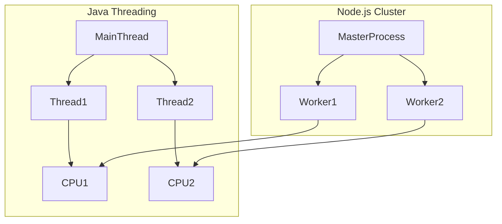

# Séance 2 – Optimisation des performances côté backend  

## Partie 3 – Gestion efficace des ressources (connexions DB, threads, cache)  

### 2. Gestion des threads et processus pour éviter le surchargement (Java, Node.js cluster)  

---

### Introduction  

La gestion des threads et processus backend est déterminante pour tirer parti des architectures multicœurs, optimiser la concurrence et éviter le surchargement du serveur. Les paradigmes diffèrent entre Java, qui utilise un modèle multithread, et Node.js, basé sur un thread unique mais supportant la montée en charge via le clustering.  

---

### A. Gestion des threads en Java  

Java utilise un modèle multithread natif permettant de gérer simultanément plusieurs tâches d’exécution.  

- Un **thread** correspond à un chemin d’exécution indépendant dans un programme.  
- Java gère des pools de threads pour optimiser la création et la réutilisation (ex: `ExecutorService`).  

**Exemple d’utilisation d’un pool de threads :**

```java
import java.util.concurrent.*;

public class ThreadPoolExample {
    public static void main(String[] args) throws InterruptedException {
        ExecutorService executor = Executors.newFixedThreadPool(5);

        for(int i = 0; i < 10; i++) {
            final int taskId = i;
            executor.submit(() -> {
                System.out.println("Exécution tâche " + taskId + " par " + Thread.currentThread().getName());
                // Simuler travail
                try { Thread.sleep(1000); } catch (InterruptedException e) {}
            });
        }
        executor.shutdown();
        executor.awaitTermination(1, TimeUnit.MINUTES);
    }
}
```

- Limiter la taille du pool évite une surcharge excessive.  
- Le scheduler (planificateur) Java gère la répartition CPU des threads.

---

### B. Modèle Node.js et gestion des processus  

Node.js est mono-threadé pour le traitement JavaScript, mais peut gérer la charge via les modules **cluster** et les processus enfants.

- Node.js utilise un **event loop** single-thread pour la plupart des opérations, évitant ainsi le coût de gestion complexe des threads.  
- Pour exploiter plusieurs cœurs CPU, on instancie plusieurs processus **forkés** avec cluster.

**Exemple simple de cluster Node.js :**

```javascript
const cluster = require('cluster');
const http = require('http');
const numCPUs = require('os').cpus().length;

if (cluster.isMaster) {
    console.log(`Master ${process.pid} is running`);

    // Fork workers.
    for (let i = 0; i < numCPUs; i++) {
        cluster.fork();
    }

    cluster.on('exit', (worker, code, signal) => {
        console.log(`Worker ${worker.process.pid} died`);
    });
} else {
    // Workers handle the HTTP requests
    http.createServer((req, res) => {
        res.writeHead(200);
        res.end('hello world\n');
    }).listen(8000);

    console.log(`Worker ${process.pid} started`);
}
```

- Chaque worker est un processus distinct capable de gérer des requêtes indépendamment.  
- Le master distribue les requêtes entre les workers, équilibrant la charge.

---

### C. Comparaison et bonnes pratiques  

| Critère                 | Java Threads                                | Node.js Cluster                              |
|-------------------------|---------------------------------------------|----------------------------------------------|
| Paradigme               | Multi-thread                                | Single-thread + multi-processus (cluster)    |
| Exploitation CPU        | Directe via threads concurrents             | Via fork processes sur plusieurs cores        |
| Gestion de la mémoire    | Concurrence plus coûteuse                    | Isolée par processus, moins de risques de conflit |
| Scénario d’usage         | Applications lourdes calculatoires            | Applications I/O intensives, serveurs web      |
| Outils supplémentaires   | ExecutorService, ForkJoinPool                | cluster, worker_threads (modules tiers)         |

---

### D. Diagramme Mermaid – Architecture cluster Node.js vs multithreading Java  



---

### E. Conseils d’optimisation  

- Dimensionner le nombre de threads ou de workers en fonction du nombre de cœurs CPU et de la nature du travail.  
- En Java, éviter la création excessive de threads et préférer des pools réutilisables.  
- En Node.js, monitorer la santé des workers et prévoir un restart automatique en cas de crash.  
- Utiliser des outils de monitoring (VisualVM, PM2, etc.) pour analyser la charge, la mémoire et la latence.

---

### Références  

- Java Concurrency Tutorial, https://docs.oracle.com/javase/tutorial/essential/concurrency/  
- Node.js Cluster API, https://nodejs.org/api/cluster.html  
- MDN Web Docs – Multithreading in JavaScript, https://developer.mozilla.org/en-US/docs/Web/JavaScript/Concurrency_and_parallelism  
- Baeldung – Java Thread Pools, https://www.baeldung.com/java-thread-pool  
- Node.js Best Practices – Clustering, https://github.com/goldbergyoni/nodebestpractices/blob/master/sections/performance/README.md#cluster  

---

### Conclusion  

Comprendre et maîtriser la gestion des threads en Java et des processus en Node.js est nécessaire pour construire des applications backend réactives et stables. Tirer parti des capacités multi-cœur en dimensionnant correctement la concurrence améliore la performance sans risquer le surchargement.