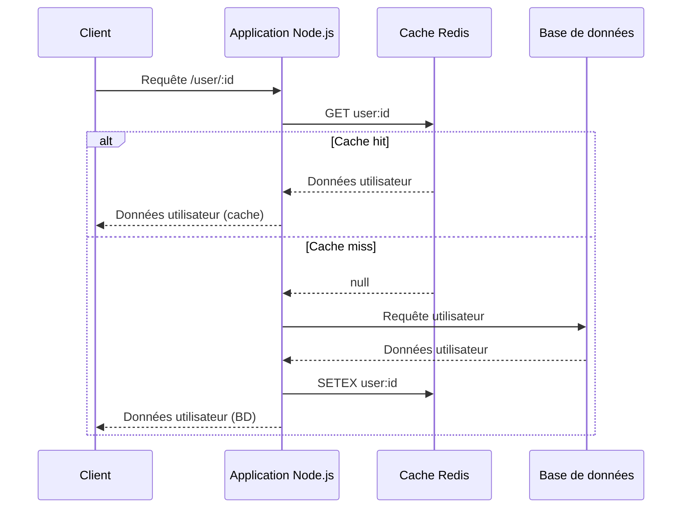

# Séance 2 – Optimisation des performances côté backend  

## Partie 4 – Caching (Spring Boot Cache, Node.js Redis, PHP OPcache)  

### 3. Utilisation de Redis avec Node.js pour un cache distribué  

---

### Introduction  

Redis est une base de données en mémoire clé-valeur très performante, fréquemment utilisée comme cache distribué. Elle permet à plusieurs instances d’une application Node.js, voire de serveurs différents, de partager un cache commun, garantissant cohérence et scalabilité.  

---

### A. Pourquoi utiliser Redis comme cache distribué ?  

- **Accès très rapide** (opérations en mémoire).  
- **Architecture distribuée** : plusieurs clients partagent un même cache.  
- **Fonctionnalités avancées** : expiration des clés, atomicité, structures complexes.  
- Supporte le **scale out** facile, idéal pour applications réparties.

---

### B. Installation et configuration  

1. Installer Redis (exemple sur Ubuntu) :

```bash
sudo apt-get install redis-server
sudo systemctl enable redis-server.service
sudo systemctl start redis-server.service
```

2. Installer le client Redis pour Node.js :

```bash
npm install redis
```

---

### C. Exemple basique d'utilisation dans Node.js  

```javascript
const redis = require('redis');
const client = redis.createClient();

client.on('error', (err) => console.error('Redis Client Error', err));

(async () => {
    await client.connect();

    const key = 'user:123';
    
    // Vérifier si la donnée est en cache
    const cacheData = await client.get(key);
    if (cacheData) {
        console.log('Cache hit:', JSON.parse(cacheData));
    } else {
        // Simuler appel à une base de données
        const userData = { id: 123, name: 'Alice' };
        // Stocker dans Redis avec une expiration de 1 heure
        await client.setEx(key, 3600, JSON.stringify(userData));
        console.log('Cache miss, données stockées');
    }

    await client.quit();
})();
```

- La fonction `setEx` permet d’enregistrer une clé avec un TTL (time to live) en secondes.  
- Le JSON.stringify/parse permet de stocker des objets complexes.

---

### D. Intégration dans une application Express.js  

```javascript
const express = require('express');
const redis = require('redis');
const client = redis.createClient();

const app = express();

(async () => {
    await client.connect();
})();

app.get('/user/:id', async (req, res) => {
    const userId = req.params.id;
    const cacheKey = `user:${userId}`;

    // Recherche dans le cache
    const cachedUser = await client.get(cacheKey);
    if (cachedUser) {
        return res.json(JSON.parse(cachedUser));
    }

    // Simuler une requête base de données lente
    const userFromDB = { id: userId, name: "Utilisateur_" + userId };
    // Stocker dans Redis (TTL 30 min)
    await client.setEx(cacheKey, 1800, JSON.stringify(userFromDB));

    res.json(userFromDB);
});

app.listen(3000, () => console.log('Serveur démarré sur le port 3000'));
```

---

### E. Diagramme Mermaid – Flux cache avec Redis dans Node.js  



---

### F. Conseils pour l’utilisation de Redis en cache distribué  

- Configurer un TTL adapté pour éviter les données obsolètes.  
- Penser à gérer les invalidations ou mises à jour du cache lors des modifications des données source.  
- Surveiller la taille du cache et la consommation mémoire.  
- Activer la persistance Redis si nécessaire (RDB, AOF) pour durabilité en cas de redémarrage.  

---

### Sources  

- Redis Documentation – https://redis.io/docs/manual/  
- Node.js Redis Client – https://github.com/redis/node-redis  
- DigitalOcean – How To Use Redis As A Cache For Node.js Apps: https://www.digitalocean.com/community/tutorials/how-to-use-redis-as-a-cache-for-node-js-applications  
- Redis Quick Start Guide – https://redis.io/docs/getting-started/  

---

### Conclusion  

Utiliser Redis comme cache distribué avec Node.js offre un moyen puissant et performant pour améliorer la réactivité des applications backend, en évitant les accès répétés aux sources lentes et en facilitant la scalabilité sur plusieurs instances.