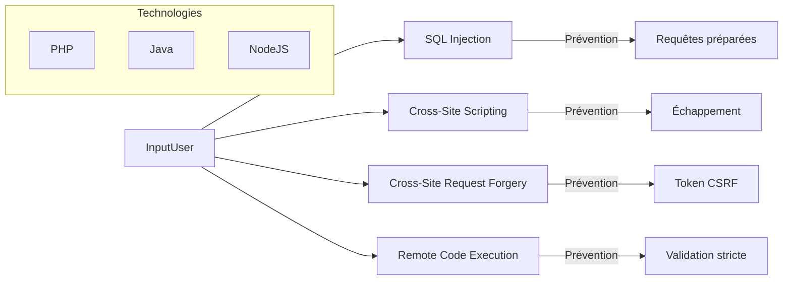

# Séance 3 – Sécurité backend (PHP, Spring Boot, Node.js)  

## Partie 1 – Principales failles backend : SQL Injection, XSS, CSRF, RCE  

### 2. Démonstrations de ces failles en PHP, Java et Node.js  

---

### A. SQL Injection  

#### PHP – Exemple vulnérable  

```php
$id = $_GET['id'];
$conn = new mysqli($servername, $username, $password, $dbname);
$sql = "SELECT * FROM users WHERE id = $id";  // Injection possible
$result = $conn->query($sql);
```

- Si `id=1 OR 1=1`, la requête retourne tous les users.  

#### PHP – Correction avec requête préparée  

```php
$stmt = $conn->prepare("SELECT * FROM users WHERE id = ?");
$stmt->bind_param("i", $_GET['id']);
$stmt->execute();
$result = $stmt->get_result();
```

---

#### Java (Spring Boot) – Exemple vulnérable  

```java
@Query("SELECT u FROM User u WHERE u.email = '" + email + "'")
User findByEmail(String email);
```

- Injection possible si `email` contient des caractères SQL.  

#### Java – Correction avec paramètres sécurisés  

```java
@Query("SELECT u FROM User u WHERE u.email = :email")
User findByEmail(@Param("email") String email);
```

---

#### Node.js – Exemple vulnérable avec mysql  

```javascript
const query = `SELECT * FROM users WHERE id = ${req.query.id}`;
connection.query(query, (err, results) => { ... });
```

- Injection possible si `req.query.id = '1 OR 1=1'`.  

#### Node.js – Correction avec requêtes préparées  

```javascript
const query = 'SELECT * FROM users WHERE id = ?';
connection.query(query, [req.query.id], (err, results) => { ... });
```

---

### B. Cross-Site Scripting (XSS)  

#### PHP – Exemple vulnérable  

```php
echo "<p>Bienvenue " . $_GET['user'] . "</p>";
```

- Si `user=<script>alert('XSS')</script>`, script malveillant exécuté.

#### Correction  

```php
echo "<p>Bienvenue " . htmlspecialchars($_GET['user'], ENT_QUOTES, 'UTF-8') . "</p>";
```

---

#### Java (Spring Boot) – Exemple vulnérable (Thymeleaf)  

```html
<p th:text="${param.user}"></p>
```

- Peut introduire du script si non échappé.  

#### Utiliser `th:text` qui échappe par défaut ou fonctions d’encodage supplémentaires si nécessaire.  

---

#### Node.js – Exemple avec Express et EJS vulnérable  

```ejs
<p>Welcome <%= user %></p> <!-- non échappé -->
```

- Danger si `user` contient des scripts.  

#### Correction  

```ejs
<p>Welcome <%- user %></p> <!-- échappement automatique -->
```

---

### C. Cross-Site Request Forgery (CSRF)  

#### PHP – Sans protection  

Formulaire POST sans token :  

```html
<form method="post" action="change_email.php">
  <input type="email" name="email">
  <button>Modifier</button>
</form>
```

- Un site tiers peut soumettre ce formulaire à l’insu de l’utilisateur.  

#### PHP – Protection avec token CSRF  

```php
session_start();
if(empty($_SESSION['token'])) {
    $_SESSION['token'] = bin2hex(random_bytes(32));
}
```

Formulaire :  

```html
<input type="hidden" name="csrf_token" value="<?= $_SESSION['token'] ?>">
```

Validation :  

```php
if(hash_equals($_SESSION['token'], $_POST['csrf_token'])) { /* exécuter */ }
else { /* bloquer */ }
```

---

#### Java (Spring Security)  

Spring Security intègre une protection CSRF activée par défaut avec token dans les formulaires.  

---

#### Node.js (Express)  

Utiliser middleware `csurf` :  

```javascript
const csrf = require('csurf');
const csrfProtection = csrf({ cookie: true });
app.use(csrfProtection);
```

---

### D. Remote Code Execution (RCE)  

#### PHP – Exemple vulnérable  

```php
include($_GET['page']);
```

- Permet inclusion de script arbitraire à distance.  

#### Correction  

- Valider une liste blanche de valeurs possibles.  

```php
$whitelist = ['home.php', 'about.php'];
if (in_array($_GET['page'], $whitelist)) {
    include($_GET['page']);
} else {
    echo "Page non autorisée.";
}
```

---

#### Java – Exécution de commandes dans ProcessBuilder (vulnérable si entrée non filtrée)  

```java
String cmd = request.getParameter("cmd");
Runtime.getRuntime().exec(cmd);
```

- Danger si `cmd` contient des commandes malveillantes.  

#### Correction  

- Ne jamais exécuter directement des commandes depuis l’input utilisateur.  
- Utiliser des commandes fixées ou vérifier strictement les paramètres.  

---

#### Node.js – Exemple vulnérable  

```javascript
const { exec } = require('child_process');
app.get('/exec', (req, res) => {
  exec(req.query.cmd, (err, stdout) => {
    res.send(stdout);
  });
});
```

- Permet l’exécution arbitraire de commandes shell.  

#### Correction  

- Ne jamais utiliser `exec` avec des données utilisateur non filtrées ou désactiver cette route.  

---

### Diagramme Mermaid – Vecteurs et protections  



---

### Sources  

- OWASP Cheat Sheet Series (Injection, XSS, CSRF, RCE)  
- Documentation officielle Spring Security (https://spring.io/projects/spring-security)  
- PHP Manual (https://www.php.net/manual/en/security.php)  
- Node.js Security Best Practices (https://expressjs.com/en/advanced/best-practice-security.html)  
- MDN Web Docs – Cross-Site Scripting (https://developer.mozilla.org/en-US/docs/Glossary/Cross-site_scripting)  

---

### Résumé  

Les exemples démontrent comment des failles classiques vont affecter les langages backend courants et comment les éviter avec des techniques spécifiques (requêtes préparées, validation, tokens CSRF, échappement). Ces bonnes pratiques doivent être intégrées systématiquement dans les développements backend pour limiter les risques.