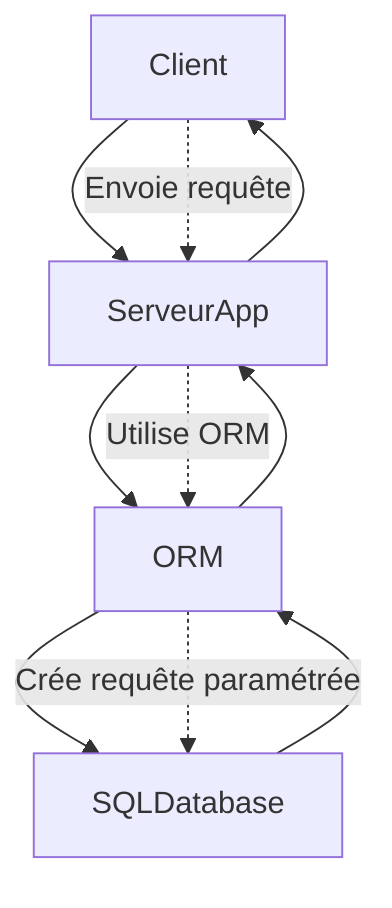

# Séance 3 – Sécurité backend (PHP, Spring Boot, Node.js)  

## Partie 2 – Bonnes pratiques : ORM (Hibernate, Sequelize), validation des entrées, paramétrisation des requêtes  

### 1. Utilisation des ORM pour prévenir les injections SQL et faciliter la manipulation des données  

---

### Introduction  

Les ORM (Object-Relational Mapping) facilitent la manipulation des données en offrant une interface orientée objet au lieu d'écrire directement des requêtes SQL. En outre, ils protègent efficacement contre les injections SQL par la gestion interne de la paramétrisation des requêtes.  

---

### A. Pourquoi utiliser un ORM ?  

- **Abstraction** : Les ORM permettent d’écrire du code métier sans manipuler directement SQL.  
- **Sécurité** : Ils parametrent automatiquement les entrées dans les requêtes, réduisant le risque d’injection SQL.  
- **Portabilité** : Un ORM peut adapter le SQL à différents SGBD sans changer le code métier.  
- **Productivité** : Simplification des opérations CRUD et gestion des relations complexes.

---

### B. ORM et prévention des injections SQL  

Les ORM construisent les requêtes avec des paramètres internes, évitant la concaténation directe de chaines avec des entrées utilisateur.  

---

### C. Exemples concrets  

#### 1. Hibernate (Java / Spring Boot)  

Définition d’une entité :  

```java
@Entity
public class User {
    @Id
    @GeneratedValue(strategy = GenerationType.IDENTITY)
    private Long id;
    private String email;
    private String name;
    // getters et setters
}
```

Requête sécurisée pour récupérer un utilisateur par email :  

```java
public User findByEmail(String email) {
    String hql = "FROM User WHERE email = :email";
    return entityManager.createQuery(hql, User.class)
        .setParameter("email", email)
        .getSingleResult();
}
```

- Le paramètre `:email` est correctement échappé par Hibernate.  
- Pas de concaténation manuelle, donc pas de risque d’injection.  

---

#### 2. Sequelize (Node.js)  

Définition d’un modèle :  

```javascript
const User = sequelize.define('User', {
  email: {
    type: Sequelize.STRING,
    allowNull: false,
  },
  name: Sequelize.STRING,
});
```

Requête sécurisée :  

```javascript
const user = await User.findOne({ where: { email: req.query.email } });
```

- Sequelize construit la requête en paramétrant `email`, sécurisant ainsi la requête.  

---

#### 3. Doctrine (PHP)  

Requête avec query builder :  

```php
$user = $entityManager->getRepository(User::class)
    ->createQueryBuilder('u')
    ->where('u.email = :email')
    ->setParameter('email', $email)
    ->getQuery()
    ->getOneOrNullResult();
```

- Le paramètre est bindé proprement, sécurisant la requête SQL.  

---

### D. Diagramme Mermaid – Flux avec ORM et gestion des requêtes  



---

### E. Bonnes pratiques avec ORM  

- Toujours utiliser les méthodes proposées par l’ORM pour créer les requêtes, éviter les concaténations manuelles.  
- Valider et nettoyer les données avant de les passer à l’ORM pour éviter des injections ou erreurs logiques.  
- Gérer les exceptions et erreurs liées aux requêtes pour détecter des anomalies ou tentatives d’attaque.  

---

### Sources  

- Hibernate Documentation, https://hibernate.org/orm/documentation/  
- Sequelize Documentation, https://sequelize.org/master/manual/  
- Doctrine ORM Documentation, https://www.doctrine-project.org/projects/orm.html  
- OWASP – Injection Prevention Cheat Sheet, https://cheatsheetseries.owasp.org/cheatsheets/Injection_Prevention_Cheat_Sheet.html  
- Baeldung – Introduction to Hibernate Query Language (HQL), https://www.baeldung.com/hibernate-hql  

---

### Conclusion  

Les ORM sont des outils puissants qui simplifient le développement backend tout en apportant une protection robuste contre les injections SQL. En combinant une utilisation correcte des ORM avec une validation rigoureuse des entrées, on minimise significativement les risques de vulnérabilités liées à la base de données.