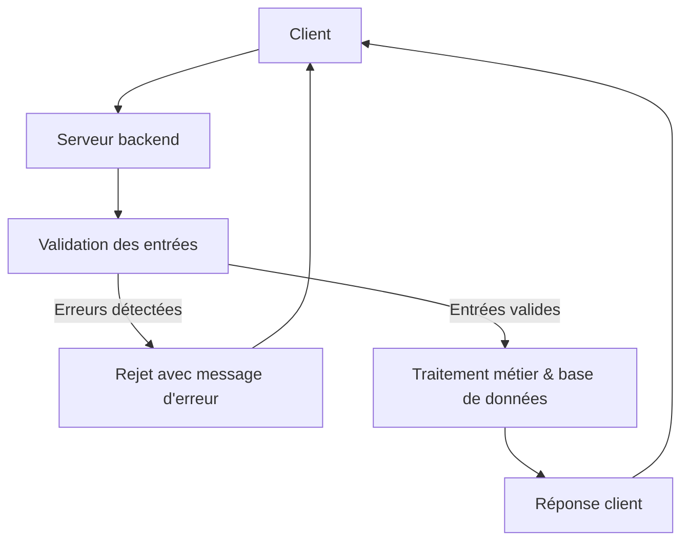

# Séance 3 – Sécurité backend (PHP, Spring Boot, Node.js)

## Partie 2 – Bonnes pratiques : ORM (Hibernate, Sequelize), validation des entrées, paramétrisation des requêtes

### 2. Techniques de validation des entrées côté serveur

---

### Introduction

La validation des entrées côté serveur est une étape fondamentale pour assurer la sécurité et l’intégrité des données dans les applications backend. Elle consiste à vérifier que les données reçues respectent des règles précises avant tout traitement ou insertion en base. Cela limite les risques d’injections, corruptions, et autres attaques.

---

### A. Pourquoi valider côté serveur ?

- Protection contre les données malveillantes ou corrompues.  
- Ne pas se fier uniquement à la validation client (JavaScript peut être contourné).  
- Améliorer la robustesse de l’application.  
- Respecter les contraintes métiers (formats, longueurs, valeurs autorisées).

---

### B. Types de validation fréquents

| Type de validation                | Description                                  | Exemples                      |
|---------------------------------|----------------------------------------------|-------------------------------|
| **Type de donnée**               | Vérifier que l'entrée est du bon type         | Int, string, date             |
| **Format**                      | Respect d’un format spécifique                 | Email, URL, numéro de téléphone |
| **Taille**                     | Limitation de la longueur ou amplitude         | Min/max caractères            |
| **Valeurs autorisées**          | Liste blanche ou gamme de valeurs              | Statuts valides, enum         |
| **Contraintes personnalisées** | Validation selon règles métiers spécifiques    | Validation d’un code postal   |

---

### C. Exemples pratiques par langage

#### 1. PHP – Validation avec filter_var()

```php
$email = $_POST['email'] ?? '';

if (!filter_var($email, FILTER_VALIDATE_EMAIL)) {
    die("Email invalide");
}

$age = $_POST['age'] ?? '';
if (!filter_var($age, FILTER_VALIDATE_INT, ["options" => ["min_range" => 18, "max_range" => 120]])) {
    die("Âge non valide");
}
```

---

#### 2. Java (Spring Boot) – Validation avec annotations Hibernate Validator

Définition d’une entité avec validation automatique :

```java
import javax.validation.constraints.*;

public class UserDTO {

    @NotBlank(message = "Le nom est obligatoire")
    private String name;

    @Email(message = "Email invalide")
    private String email;

    @Min(value = 18, message = "Âge minimum 18 ans")
    @Max(value = 120, message = "Âge maximum 120 ans")
    private int age;

    // getters et setters
}
```

Contrôleur Spring Boot qui valide automatiquement :

```java
@PostMapping("/users")
public ResponseEntity<String> createUser(@Valid @RequestBody UserDTO user, BindingResult result) {
    if (result.hasErrors()) {
        return ResponseEntity.badRequest().body(result.getAllErrors().toString());
    }
    // Traitement métier...
    return ResponseEntity.ok("Utilisateur créé");
}
```

---

#### 3. Node.js (Express) – Validation avec express-validator

Middleware express-validator utilisé dans une route :

```javascript
const { body, validationResult } = require('express-validator');

app.post('/register',
  body('email').isEmail().withMessage('Email invalide'),
  body('password').isLength({ min: 8 }).withMessage('Mot de passe trop court'),
  (req, res) => {
    const errors = validationResult(req);
    if (!errors.isEmpty()) {
      return res.status(400).json({ errors: errors.array() });
    }
    // Traitement métier...
    res.send('Inscription réussie');
  }
);
```

---

### D. Diagramme Mermaid – Processus de validation côté serveur



---

### E. Bonnes pratiques complémentaires

- **Ne pas faire confiance à la validation client**, toujours valider côté serveur.  
- Retourner des messages d’erreur explicites mais sans révéler trop d’informations sensibles.  
- Valider toutes les données externes, y compris les headers, paramètres URL, et corps de requêtes.  
- Utiliser des bibliothèques testées et reconnues pour les validations.  
- Combiner validation et sanitation (nettoyage) des entrées si besoin.

---

### Sources

- PHP Official: https://www.php.net/manual/fr/filter.filters.validate.php  
- Hibernate Validator Documentation: https://hibernate.org/validator/documentation/  
- express-validator GitHub: https://github.com/express-validator/express-validator  
- OWASP Input Validation Cheat Sheet: https://cheatsheetseries.owasp.org/cheatsheets/Input_Validation_Cheat_Sheet.html

---

### Conclusion

La validation côté serveur joue un rôle clé pour prévenir des attaques, garantir la qualité des données et respecter les règles métiers. L’utilisation d’outils et bibliothèques dédiés, adaptés à chaque environnement (PHP, Java, Node.js), permet d’implémenter cette étape de manière fiable et maintenable.