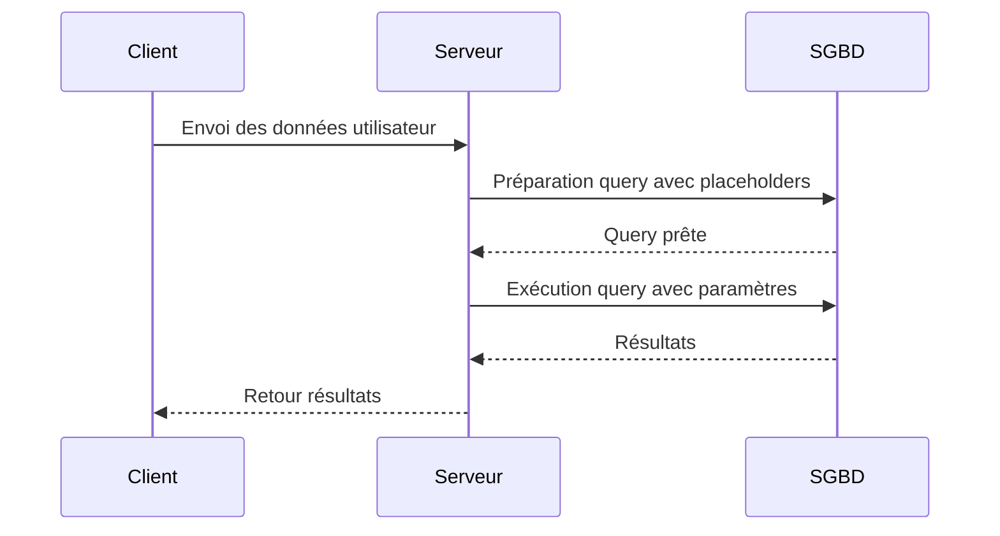

# Séance 3 – Sécurité backend (PHP, Spring Boot, Node.js)  

## Partie 2 – Bonnes pratiques : ORM (Hibernate, Sequelize), validation des entrées, paramétrisation des requêtes  

### 3. Implémentation des requêtes préparées pour sécuriser les interactions avec la base de données (JDBC, Knex.js, PDO)  

---

### Introduction  

Les requêtes préparées sont une pratique essentielle pour prévenir les injections SQL. Elles permettent de séparer la structure de la requête SQL des données utilisateur, évitant ainsi que ces dernières soient interprétées comme du code. Voici comment les mettre en œuvre dans trois environnements backend majeurs : Java (JDBC), Node.js (Knex.js) et PHP (PDO).  

---

### A. Généralités sur les requêtes préparées  

- **Concept :** Le moteur SQL prépare une requête avec des placeholders (paramètres) et associe les valeurs séparément.  
- **Avantages :** Protection contre l’injection SQL, optimisation possible par le SGBD, et meilleur lisibilité du code.  

---

### B. Java – JDBC (Java Database Connectivity)  

#### Exemple de requête vulnérable (non préparée) :  

```java
String id = request.getParameter("id");
String sql = "SELECT * FROM users WHERE id = " + id;
Statement stmt = connection.createStatement();
ResultSet rs = stmt.executeQuery(sql);
```

- Danger : si `id` vaut `1 OR 1=1`, la requête est modifiée (injection SQL).  

#### Exemple avec requête préparée sécurisée :

```java
String sql = "SELECT * FROM users WHERE id = ?";
PreparedStatement pstmt = connection.prepareStatement(sql);
pstmt.setInt(1, Integer.parseInt(request.getParameter("id")));
ResultSet rs = pstmt.executeQuery();
```

- La valeur est passée séparément, assurant son interprétation comme donnée.  

---

### C. Node.js – Knex.js (Query Builder)  

#### Requête vulnérable typique (sans Knex) :  

```javascript
const id = req.query.id;
const query = `SELECT * FROM users WHERE id = ${id}`;
db.raw(query).then(...);
```

#### Utilisation de Knex pour requêtes préparées :  

```javascript
const id = req.query.id;
knex('users').where('id', id).select('*').then(results => {
  // traitement
});
```

- Knex paramètre automatiquement les valeurs et évite les injections.  

#### Exemple avec Knex.raw et binding explicite :  

```javascript
const id = req.query.id;
knex.raw('SELECT * FROM users WHERE id = ?', [id])
  .then(results => { /* traitement */ });
```

---

### D. PHP – PDO (PHP Data Objects)  

#### Requête vulnérable :  

```php
$id = $_GET['id'];
$sql = "SELECT * FROM users WHERE id = $id";
$pdo->query($sql);
```

#### Requête préparée avec PDO :  

```php
$id = $_GET['id'];
$stmt = $pdo->prepare("SELECT * FROM users WHERE id = ?");
$stmt->execute([$id]);
$results = $stmt->fetchAll();
```

- La méthode `prepare()` crée la requête avec un placeholder, et `execute()` associe la valeur.  

---

### E. Schéma Mermaid – flux d’une requête préparée  



---

### F. Conseils d’implémentation  

- Toujours utiliser des requêtes préparées ou ORMs avec paramétrage automatique.  
- Ne jamais concaténer directement des chaînes avec des variables utilisateur pour générer du SQL.  
- Valider les données côté serveur avant de les passer à la requête.  
- Utiliser des types explicites (exemple `setInt()`, `bindParam()`) pour renforcer la sécurité et éviter les erreurs de conversion.  
- Gérer les erreurs possibles de précompilation ou exécution pour détecter les anomalies.  

---

### Sources  

- Oracle JDBC Tutorial – Prepared Statements : https://docs.oracle.com/javase/tutorial/jdbc/basics/prepared.html  
- Knex.js Documentation – Query Builder : https://knexjs.org/#Builder-where  
- PHP.net – PDO Prepared Statements : https://www.php.net/manual/en/pdo.prepared-statements.php  
- OWASP – Injection Prevention Cheat Sheet : https://cheatsheetseries.owasp.org/cheatsheets/Injection_Prevention_Cheat_Sheet.html  

---

### Conclusion  

Les requêtes préparées sont un mécanisme simple mais puissant pour sécuriser les interactions avec la base de données. Leur application cohérente dans différents environnements backend élimine une des principales sources de vulnérabilités : l’injection SQL. L’utilisation des outils adaptés (JDBC, Knex.js, PDO) garantit un code sûr, maintenable et performant.