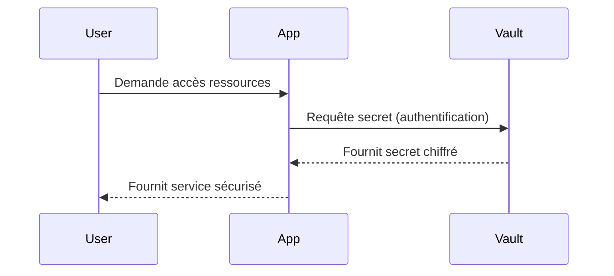

# Séance 3 – Sécurité backend (PHP, Spring Boot, Node.js)

## Partie 3 – Gestion des secrets (fichiers `.env`, Vault)

### 1. Stockage sécurisé des clés API, identifiants de base de données, etc.

---

### Introduction

Les secrets tels que clés API, identifiants de base de données, jetons d'authentification, doivent être stockés et gérés de manière sécurisée pour éviter qu’ils ne soient exposés, ce qui pourrait compromettre la sécurité de l’application et des données utilisateurs.

---

### A. Bonnes pratiques pour le stockage des secrets

| Principe                         | Description                                   |
|---------------------------------|-----------------------------------------------|
| Ne jamais stocker dans le code   | Éviter de coder en dur les secrets dans le dépôt source. |
| Utiliser des fichiers `.env`     | Stocker les secrets dans des fichiers de configuration externes, exclus des dépôts (`.gitignore`). |
| Protéger l’accès aux fichiers    | Restreindre les permissions au strict nécessaire sur les fichiers contenant les secrets. |
| Utiliser des gestionnaires de secrets centralisés | Solutions comme HashiCorp Vault, AWS Secrets Manager, Google Secret Manager. |
| Rotation régulière des secrets   | Changer périodiquement les clés pour limiter les risques en cas de fuite. |
| Journaliser les accès            | Suivre qui accède aux secrets, pour audit et détection d’anomalies. |

---

### B. Utilisation des fichiers `.env`

1. **Fonctionnement :**  
Un fichier `.env` contient des paires clé-valeur, par exemple :

```bash
DB_HOST=localhost
DB_USER=appuser
DB_PASS=supersecretpassword
API_KEY=abc123xyz
```

2. **Implémentation commune :**

- **Node.js – package `dotenv`**  

```javascript
require('dotenv').config();
console.log(process.env.DB_USER);
```

- **PHP – package `vlucas/phpdotenv`**  

```php
$dotenv = Dotenv\Dotenv::createImmutable(__DIR__);
$dotenv->load();
echo $_ENV['DB_USER'];
```

- **Spring Boot – via `application.properties` ou `application.yml`** avec variables d'environnement  

```properties
spring.datasource.username=${DB_USER}
spring.datasource.password=${DB_PASS}
```

3. **Sécurité :**  

- Ajouter `.env` dans `.gitignore` pour éviter l'inclusion dans le dépôt.  
- Ne pas stocker de `.env` contenant secrets sur les serveurs accessibles au public.  

---

### C. Gestion des secrets avec Vault (exemple HashiCorp Vault)

HashiCorp Vault est un outil dédié à la gestion centralisée des secrets, offrant :

- Chiffrement des secrets au repos.  
- Contrôle d’accès basé sur des politiques (RBAC).  
- Rotation automatique et génération dynamique de secrets (ex : bases de données, cloud).  
- Audit des accès.  

---

#### Exemple de workflow simple avec Vault



- L’application récupère temporairement des secrets lors de son démarrage ou à la demande.  
- Les secrets ne sont pas stockés en clair sur la machine.  

---

### D. Exemples d’utilisation

#### 1. Stockage des secrets dans un `.env` avec Node.js

```bash
DB_PASSWORD=SuperSecretPass123
API_TOKEN=abcdef123456
```

```javascript
require('dotenv').config();

const dbPassword = process.env.DB_PASSWORD;
console.log("Connexion avec mot de passe : ", dbPassword);
```

#### 2. Utilisation de Vault avec Spring Boot (simplifié)

- Configurer Vault dans `application.yml` :

```yaml
spring:
  cloud:
    vault:
      uri: http://localhost:8200
      token: s.xxxxxxxx
      kv:
        enabled: true
        backend: secret
        default-context: application
```

- L’application obtient les secrets lors de la connexion au démarrage via Spring Vault Client.  

---

### E. Diagramme Mermaid – Cycle de vie d’un secret sécurisé

```mermaid
graph TD
    A[Développeur] --> B[Stockage secret sécurisé (Vault/.env)]
    B --> C[Application Backend]
    C --> D[Base de données / API]
    D --> E[Accès sécurisé]
    F[Rotation secrets périodique] --> B
    G[Audit & logs] --> B
```

---

### Sources

- HashiCorp Vault Documentation : https://www.vaultproject.io/docs  
- Dotenv Node.js : https://www.npmjs.com/package/dotenv  
- PHP dotenv : https://github.com/vlucas/phpdotenv  
- Spring Cloud Vault : https://cloud.spring.io/spring-cloud-vault/reference/html/  
- OWASP Secrets Management Cheat Sheet : https://cheatsheetseries.owasp.org/cheatsheets/Secrets_Management_Cheat_Sheet.html  

---

### Résumé

Garder les secrets hors du code source et les gérer via des solutions adaptées réduit drastiquement les risques de compromission. Le fichier `.env` offre une méthode simple mais nécessite discipline (exclusion du dépôt, restrictions d’accès). Pour des besoins plus robustes et évolutifs, des outils spécialisés comme Vault apportent des garanties supplémentaires, notamment pour la rotation et la traçabilité des accès.