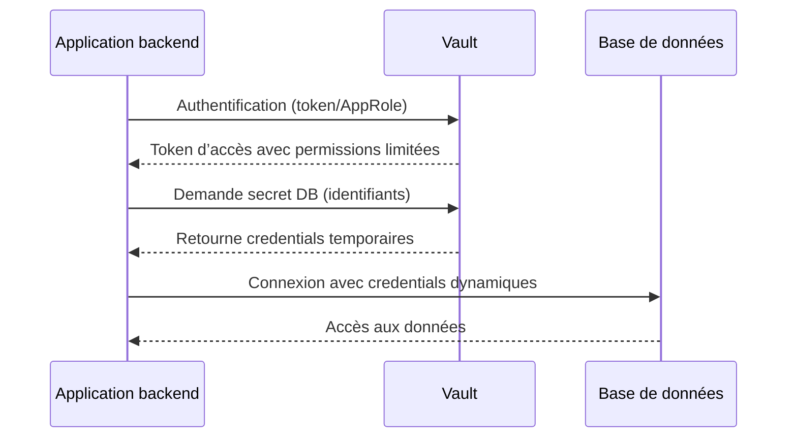
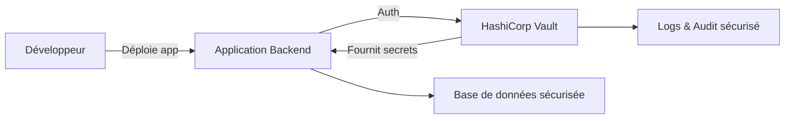

# Séance 3 – Sécurité backend (PHP, Spring Boot, Node.js)

## Partie 3 – Gestion des secrets (fichiers `.env`, Vault)

### 3. Introduction à des solutions plus robustes comme HashiCorp Vault pour la production

---

### Introduction

Pour la gestion des secrets en environnement de production, l’utilisation de fichiers `.env` s’avère limitée et risquée. Des solutions spécialisées comme HashiCorp Vault offrent une gestion centralisée, sécurisée et dynamique des secrets, répondant aux exigences de sécurité, rotation et audit propres aux applications critiques.

---

### A. Qu’est-ce que HashiCorp Vault ?  

HashiCorp Vault est une solution open-source conçue pour sécuriser, stocker et contrôler strictement l’accès à des secrets tels que clés API, mots de passe, certificats, et tokens d’identification.

**Fonctionnalités principales :**  

- **Stockage chiffré des secrets** : Vault chiffre tous les secrets avant de les sauvegarder.  
- **Contrôle d’accès basé sur la politique (RBAC)**.  
- **Authentification variée** : tokens, AppRole, LDAP, Kubernetes...  
- **Rotation automatique des secrets** : génération dynamique de credentials, notamment pour bases de données.  
- **Audit complet des accès et opérations**.  
- **Intégration avec les systèmes CI/CD et orchestrateurs (Kubernetes, Terraform).**  

---

### B. Pourquoi utiliser Vault en production ?

| Points clés                  | Description                                               |
|-----------------------------|-----------------------------------------------------------|
| Sécurité renforcée           | Minimisation du stockage local des secrets en clair.      |
| Accès dynamique             | Secrets éphémères et rotation fréquente.                   |
| Centralisation et gestion    | Facilité pour auditer et contrôler les accès.              |
| Évolutivité                 | Convient aux architectures distribuées et microservices.  |

---

### C. Exemple de fonctionnement de Vault

Imaginons une application backend qui doit accéder à une base de données sécurisée :



- Les identifiants DB sont délivrés temporairement, empêchant leur réutilisation prolongée en cas de compromission.  
- Vault garde un audit complet de ces accès.  

---

### D. Mise en œuvre rapide avec Spring Boot

Spring Cloud Vault simplifie l’intégration :

```yaml
spring:
  cloud:
    vault:
      uri: http://vault-server:8200
      token: s.XXXXXX
      authentication: TOKEN
      kv:
        enabled: true
        backend: secret
        default-context: application
```

Code d’accès aux configurations Vault dans l’application via propriétés injectées :

```java
@Value("${db.username}")
private String username;

@Value("${db.password}")
private String password;
```

Les secrets sont chargés dynamiquement en démarrant l’application.

---

### E. Utilisation dans Node.js avec `node-vault`

Installation :

```bash
npm install node-vault
```

Exemple basique pour récupérer un secret :

```javascript
const vault = require('node-vault')({ endpoint: 'http://vault-server:8200', token: 's.XXXXXX' });

async function getSecret() {
  try {
    const secret = await vault.read('secret/data/myapp');
    console.log(secret.data.data);
  } catch (err) {
    console.error('Erreur Vault:', err);
  }
}
getSecret();
```

---

### F. Intégration PHP avec Vault

Bien que l’écosystème PHP ne dispose pas d’une bibliothèque officielle Vault aussi mature, des accès HTTP via `curl` ou des packages tiers permettent de consommer l’API REST de Vault.

Exemple d’appel HTTP pour récupérer un secret :

```php
$token = 's.XXXXXX';
$url = 'http://vault-server:8200/v1/secret/data/myapp';

$ch = curl_init();
curl_setopt($ch, CURLOPT_URL, $url);
curl_setopt($ch, CURLOPT_HTTPHEADER, ["X-Vault-Token: $token"]);
curl_setopt($ch, CURLOPT_RETURNTRANSFER, true);
$response = curl_exec($ch);
curl_close($ch);

$data = json_decode($response, true);
$secret = $data['data']['data'] ?? [];
print_r($secret);
```

---

### G. Diagramme Mermaid – Architecture simplifiée avec Vault en production  



---

### Sources

- HashiCorp Vault Documentation : https://www.vaultproject.io/docs  
- Spring Cloud Vault : https://cloud.spring.io/spring-cloud-vault/reference/html/  
- Node-vault NPM : https://www.npmjs.com/package/node-vault  
- OWASP Secrets Management Cheat Sheet : https://cheatsheetseries.owasp.org/cheatsheets/Secrets_Management_Cheat_Sheet.html

---

### Conclusion

HashiCorp Vault apporte une couche importante de sécurité pour la gestion des secrets en production grâce à son chiffrement, son contrôle d’accès granulaires, la rotation automatique et l’audit des accès. Son intégration dans les backend modernes via différents langages facilite le développement d’applications sécurisées et conformes aux exigences de gouvernance.