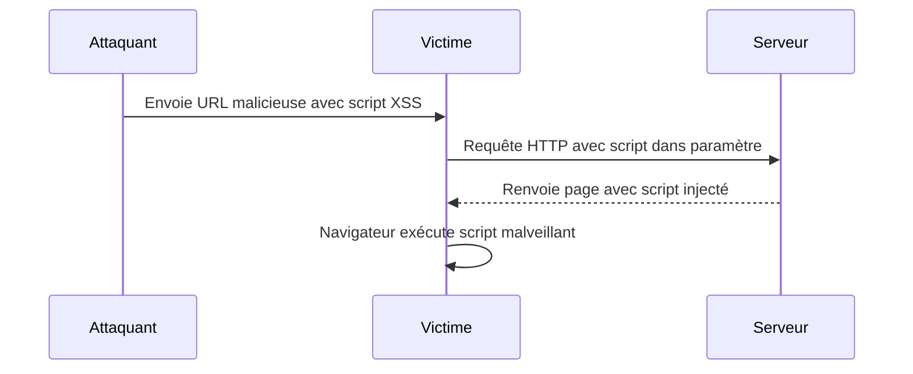

# Séance 4 – Sécurité frontend et APIs  
## Partie 1 – Sécurité côté client : XSS, injections JS  
### 1. Explication des failles Cross-Site Scripting (XSS) et injections JavaScript  

---

### A. Définitions  

**Cross-Site Scripting (XSS)** est une vulnérabilité web qui permet à un attaquant d'injecter du code JavaScript malveillant dans une page visitée par d'autres utilisateurs. Ce script malveillant est alors exécuté dans le contexte du navigateur des victimes et peut voler des cookies, manipuler le DOM, rediriger vers des sites malveillants, ou réaliser d’autres actions malicieuses.

**Injection JavaScript** est une forme d’attaque consécutive à une mauvaise validation ou échappement des données utilisateurs, aboutissant à l’exécution non souhaitée de code JS dans le navigateur.

---

### B. Types de XSS  

1. **Stored (persistant)** : Le script malveillant est stocké sur le serveur (ex : base de données, forum, commentaire) et servi à chaque visite.  
2. **Reflected (non persistant)** : Le script est inclus dans l’URL ou une requête, renvoyé immédiatement dans la réponse HTTP.  
3. **DOM-based XSS** : Le script malveillant est injecté et exécuté entièrement côté client en manipulant le DOM via du code JavaScript vulnérable.  

---

### C. Pourquoi XSS est dangereux ?  

- Vol de session/cookies utilisateur.  
- Défiguration du site.  
- Redirections vers des sites de phishing.  
- Injection de ransomwares ou malwares via navigateur.  

---

### D. Exemple simple d’attaque Reflected XSS

Supposons une page affichant un message personnalisé issu d’un paramètre GET sans échappement :  

```html
<html>
<body>
  <h1>Bienvenue, <script>document.write(location.search.split('name=')[1])</script></h1>
</body>
</html>
```

URL de l’attaque :  
```
http://exemple.com/?name=<script>alert('XSS')</script>
```

Résultat : une alerte JavaScript apparaît, démontrant l’injection.  

---

### E. Schéma Mermaid – Flux d’une attaque XSS reflectée



---

### F. Méthodes de prévention

| Technique                         | Description                                   | Exemple                          |
|----------------------------------|-----------------------------------------------|---------------------------------|
| **Échappement des données**      | Transformer les caractères spéciaux en entités HTML | `&lt;`, `&gt;` pour `<` et `>`  |
| **Content Security Policy (CSP)**| Politique HTTP limitant les sources de scripts | `Content-Security-Policy: default-src 'self'` |
| **Validation stricte côté client/serveur** | Vérification et nettoyage des entrées utilisateur | Utiliser des bibliothèques de validation |
| **Utilisation de frameworks sécurisés** | Angular, React échappent automatiquement les données insérées dans le DOM | ReactJS `dangerouslySetInnerHTML` à utiliser prudemment |
| **Désactivation de l’injection de code** | Ne jamais insérer directement du contenu non fiable dans `innerHTML` ou `eval()` | Préférer `textContent` ou `innerText` |

---

### G. Exemple de prévention : échappement en JavaScript vanilla

```javascript
function escapeHTML(str) {
  const div = document.createElement('div');
  div.textContent = str;
  return div.innerHTML;
}

const user_input = "<script>alert('XSS')</script>";
document.getElementById('output').innerHTML = escapeHTML(user_input);
```

---

### H. Points spécifiques au DOM-based XSS  

- Attaques dans lesquelles les données malveillantes sont insérées via le DOM, sans passage par le serveur.  
- Code JavaScript vulnérable lit des données issues de l’URL, `document.referrer`, ou stockage local et les insère sans validation dans la page.  

---

### I. Références et bonnes pratiques OWASP  

- OWASP XSS Definition : https://owasp.org/www-community/attacks/xss/  
- OWASP XSS Prevention Cheat Sheet : https://cheatsheetseries.owasp.org/cheatsheets/Cross_Site_Scripting_Prevention_Cheat_Sheet.html  
- Guide CSP : https://developer.mozilla.org/en-US/docs/Web/HTTP/CSP  

---

### Résumé  

Les attaques XSS exploitent le manque d’échappement et de validation des données côté client pour injecter du code JavaScript malveillant. Leur prévention passe par le filtrage des entrées, l’échappement des sorties, la mise en place de politiques CSP strictes, et l’utilisation de bonnes pratiques dans l’écriture du code frontend.  

Ces mesures réduisent considérablement la surface d’attaque et protègent l’intégrité ainsi que la confidentialité des utilisateurs.