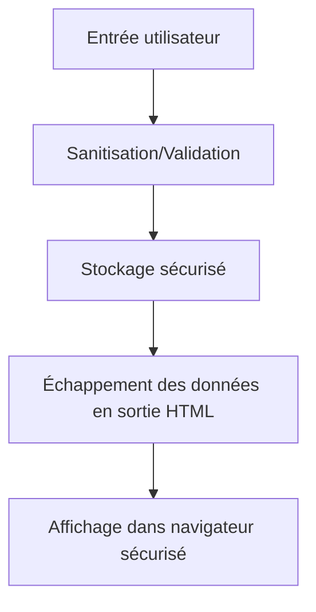

# Séance 4 – Sécurité frontend et APIs  
## Partie 1 – Sécurité côté client : XSS, injections JS  
### 2. Méthodes de prévention : échappement, sanitisation des entrées utilisateur  

---

### A. Comprendre la prévention des attaques XSS  

Les attaques Cross-Site Scripting (XSS) exploitent principalement le fait que des données non sécurisées insérées dans une page web sont interprétées comme du code. Pour bloquer ce vecteur, deux mécanismes clés sont utilisés :  

- **Échappement** (escaping) : neutraliser les caractères spéciaux dans la sortie affichée pour empêcher l’exécution de code.  
- **Sanitisation** (nettoyage) : filtrer, valider ou purifier les données entrantes avant traitement ou stockage.  

Les deux sont complémentaires et doivent être appliqués selon le contexte (entrée, stockage, sortie).  

---

### B. Échappement (escaping) des données  

#### Principe

Transformer certains caractères en entités HTML/XML afin qu’ils soient affichés en texte et non interprétés comme code.

|Caractère|Entité HTML|
|---------|-----------|
|`<`      |`&lt;`      |
|`>`      |`&gt;`      |
|`&`      |`&amp;`     |
|`"`      |`&quot;`    |
|`'`      |`&#x27;`   |
|`/`      |`&#x2F;`   |

#### Exemple simple en JavaScript :

```javascript
function escapeHTML(str) {
  return str.replace(/[&<>"'\/]/g, function(s) {
    return {
      '&': '&amp;',
      '<': '&lt;',
      '>': '&gt;',
      '"': '&quot;',
      "'": '&#x27;',
      '/': '&#x2F;'
    }[s];
  });
}

const unsafe = '<script>alert("XSS")</script>';
const safe = escapeHTML(unsafe);
document.getElementById('output').innerHTML = safe;
```

---

### C. Sanitisation des entrées utilisateur  

#### Objectifs  

- Interdire ou filtrer les caractères ou contenus malveillants.  
- Empêcher la persistance de scripts malicieux dans les bases de données ou caches (XSS stocké).  

#### Techniques courantes  

- **Whitelisting** : accepter seulement des caractères/formats contrôlés (ex : alphanumériques pour un nom).  
- **Blacklisting** : rejeter caractères/scripts connus malveillants (moins sûr que whitelist).  
- **Utilisation de bibliothèques spécialisées**  
  - Exemple : DOMPurify pour HTML purging côté client.  

#### Exemple d’utilisation DOMPurify (JS) :  

```javascript
// Chargement de DOMPurify via CDN ou npm
const cleanHTML = DOMPurify.sanitize(dirtyInput);
document.getElementById('content').innerHTML = cleanHTML;
```

DOMPurify supprime ou encode les balises/scripts dangereux tout en conservant les formats HTML valides.

---

### D. Le bon usage selon le contexte  

| Contexte                 | Action recommandée                             |
|--------------------------|------------------------------------------------|
| Affichage dans HTML       | Échapper toutes les données injectées          |
| Injection dans attributs HTML | Échapper caractères spéciaux spécifiques aux attributs  |
| Insertion dans JavaScript | Utiliser JSON.stringify ou encodage spécifique  |
| Stockage des données      | Valider et nettoyer avant sauvegarde            |
| Requête API / Base de données | Utiliser des requêtes préparées et validation  |

---

### E. Diagramme Mermaid : Flux d’une prévention XSS complète  



---

### F. Autres bonnes pratiques

- **Utiliser des frameworks avec protections intégrées** (React, Angular, Vue.js échappent automatiquement l’affichage dynamique).  
- **Préférer l’insertion dans le DOM via `textContent` plutôt que `innerHTML`.**  
- **Définir une Content Security Policy (CSP)** pour limiter l’exécution de scripts non autorisés.  
- **Ne jamais utiliser `eval()` ou fonctions similaires sur des données utilisateurs.**

---

### Sources  

- OWASP XSS Prevention Cheat Sheet – https://cheatsheetseries.owasp.org/cheatsheets/Cross_Site_Scripting_Prevention_Cheat_Sheet.html  
- DOMPurify Documentation – https://github.com/cure53/DOMPurify  
- Mozilla Developer Network (MDN) – https://developer.mozilla.org/en-US/docs/Web/HTTP/CSP  
- Google Web Fundamentals – https://web.dev/strict-csp/  

---

### Synthèse  

L’échappement et la sanitisation sont essentiels pour neutraliser les données dangereuses qui pourraient provoquer des exécutions JavaScript non désirées. Appliquées rigoureusement, elles représentent la première ligne de défense contre les attaques XSS, en transformant les données potentiellement nuisibles en contenu inoffensif. Adapter la méthode au contexte d’utilisation garantit une protection optimale, renforcée par des mécanismes côté client (frameworks sécurisés) et côté serveur (validation et requêtes paramétrées).