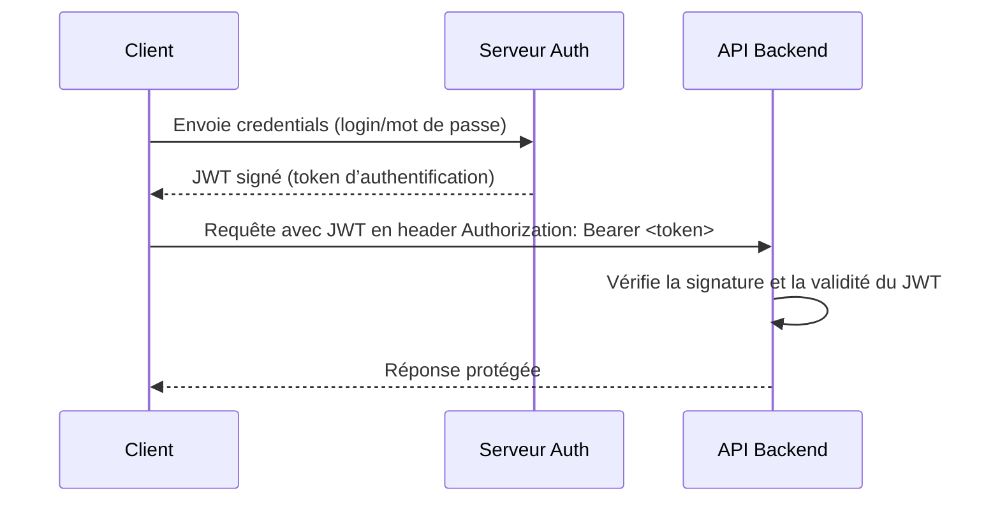

# Séance 4 – Sécurité frontend et APIs  
## Partie 2 – Communication sécurisée avec API : HTTPS, JWT, CORS  
### 2. Fonctionnement et utilisation des JSON Web Tokens (JWT) pour l'authentification  

---

### A. Qu’est-ce qu’un JSON Web Token (JWT) ?  

Un JWT est un standard ouvert (RFC 7519) permettant d'échanger de façon sécurisée des informations entre deux parties sous forme d’un objet JSON signé et encodé. Il est largement utilisé pour l'authentification et la gestion des sessions dans les architectures APIs modernes.

---

### B. Structure d’un JWT  

Un JWT est constitué de trois parties, séparées par des points `.` :  

```
header.payload.signature
```

- **Header** : indique l'algorithme de signature et le type de token (typiquement `{"alg":"HS256","typ":"JWT"}`).  
- **Payload** : contient les "claims" (informations sur l’utilisateur, les droits, expiration, etc).  
- **Signature** : permet de garantir l’intégrité et l’authenticité du token via un secret partagé ou une clé privée.

Chaque partie est encodée en Base64URL.  

---

### C. Exemple de JWT décomposé

```json
// Header décodé
{
  "alg": "HS256",
  "typ": "JWT"
}

// Payload décodé
{
  "sub": "1234567890",
  "name": "Alice",
  "iat": 1615159071,
  "exp": 1615162671
}
```

Signature générée avec la clé secrète et algorithme HMAC-SHA256.

---

### D. Fonctionnement général du JWT pour l’authentification  



- Le client stocke le JWT (dans localStorage, cookie sécurisé ou mémoire selon contexte).  
- Le token est envoyé dans chaque requête pour prouver l'identité.  
- Le backend vérifie le token sans nécessiter de stockage serveur (stateless).  

---

### E. Avantages et limites  

| Avantages                         | Limites                                   |
|----------------------------------|-------------------------------------------|
| Stateless, pas besoin de session serveur | Exposition possible si mauvaise gestion du stockage client  |
| Facilement transposable sur plusieurs services (microservices) | Pas invalidable à chaud sans mécanisme supplémentaire (ex : blacklist) |
| Support des claims personnalisés | Taille relativement grande (comparé aux cookies simples) |
| Signature vérifiable sans secret partagé (avec JWT asymétrique) | Nécessite une gestion rigoureuse de la clé de signature |

---

### F. Exemple simple en Node.js pour créer un JWT

```javascript
const jwt = require('jsonwebtoken');

const payload = {
  sub: 'user123',
  name: 'Alice',
  iat: Math.floor(Date.now() / 1000),
  exp: Math.floor(Date.now() / 1000) + 3600 // Expiration dans 1h
};

const secret = 'votre_clef_secrète';

const token = jwt.sign(payload, secret, { algorithm: 'HS256' });
console.log('Token JWT:', token);
```

---

### G. Vérification du JWT côté backend

```javascript
try {
  const decoded = jwt.verify(token, secret);
  console.log('Token valide, données:', decoded);
} catch (e) {
  console.error('Token invalide ou expiré');
}
```

---

### H. Bonnes pratiques à respecter  

- **Ne pas stocker de données sensibles en clair dans le payload.**  
- **Utiliser HTTPS pour éviter les interceptions de tokens.**  
- **Privilégier les tokens avec expiration courte.**  
- **Gérer la révocation via liste noire ou rotation des clés.**  
- **Utiliser le champ `aud` (audience) et `iss` (issuer) pour valider le contexte.**  

---

### Sources  

- RFC 7519 JSON Web Token (JWT) : https://tools.ietf.org/html/rfc7519  
- Auth0 JWT Introduction : https://auth0.com/learn/json-web-tokens/  
- OWASP Authentication Cheat Sheet (sections JWT) : https://cheatsheetseries.owasp.org/cheatsheets/Authentication_Cheat_Sheet.html  
- npm jsonwebtoken package : https://www.npmjs.com/package/jsonwebtoken  

---

### Synthèse  

Le JSON Web Token est un standard moderne, efficace et scalable pour gérer l’authentification des utilisateurs dans les applications frontend-backend. Grâce à sa nature signée et encodée, il permet de vérifier rapidement l’identité et les droits sans maintenir de sessions serveurs, à condition de respecter les bonnes pratiques liées à sa sécurisation et gestion côté client.