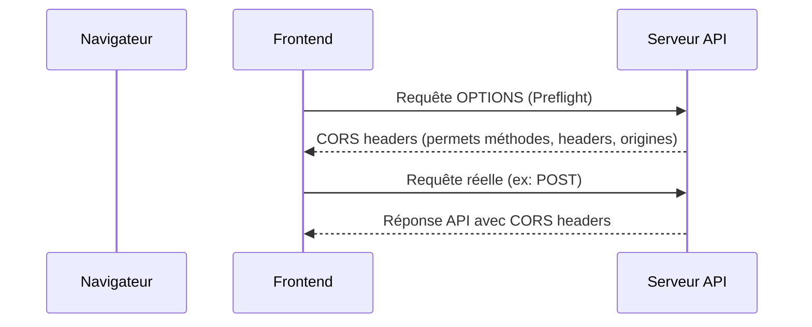

# Séance 4 – Sécurité frontend et APIs  
## Partie 2 – Communication sécurisée avec API : HTTPS, JWT, CORS  
### 3. Configuration des Cross-Origin Resource Sharing (CORS) pour contrôler l'accès aux ressources  

---

### A. Qu’est-ce que CORS ?  

CORS (Cross-Origin Resource Sharing) est un mécanisme de sécurité côté navigateur qui contrôle comment les ressources d’un serveur peuvent être accédées depuis une origine différente (domaine, port ou protocole).  

Par défaut, les navigateurs appliquent la politique de même origine (same-origin policy) qui bloque les requêtes cross-origin non explicites pour protéger les utilisateurs. CORS permet de gérer plus finement ces accès légitimes.  

---

### B. Pourquoi CORS est-il nécessaire ?  

- Les applications modernes frontends (JS, React, Angular) consomment souvent des APIs REST situées sur des domaines différents.  
- Sans CORS configuré, le navigateur bloque ces requêtes cross-origin, même si le serveur accepte la requête.  
- CORS permet au serveur d’indiquer via des en-têtes HTTP quelles origines peuvent accéder à ses ressources, quelles méthodes, quels headers, etc.  

---

### C. Fonctionnement du contrôle CORS  

1. **Requête simple** (GET, POST avec headers standards) :  
   Le navigateur inclut automatiquement un en-tête `Origin` faisant référence à la page appelante.  
2. **Requête préliminaire (preflight)** :  
   Pour les méthodes sensibles (PUT, DELETE) ou headers personnalisés, le navigateur envoie une requête HTTP `OPTIONS` pour vérifier si le serveur autorise la demande.  

Le serveur répond avec des en-têtes CORS tels que :  
- `Access-Control-Allow-Origin` : origine(s) autorisées  
- `Access-Control-Allow-Methods` : méthodes HTTP autorisées  
- `Access-Control-Allow-Headers` : headers acceptés  
- `Access-Control-Allow-Credentials` : si les cookies sont autorisés  

---

### D. Exemple d’en-têtes CORS retournés par un serveur autorisant une origine spécifique

```
Access-Control-Allow-Origin: https://monfrontend.com
Access-Control-Allow-Methods: GET, POST, PUT
Access-Control-Allow-Headers: Content-Type, Authorization
Access-Control-Allow-Credentials: true
```

---

### E. Exemple pratique pour activer CORS en Node.js avec Express

```javascript
const express = require('express');
const cors = require('cors');

const app = express();

const corsOptions = {
    origin: 'https://monfrontend.com',
    methods: ['GET', 'POST', 'PUT'],
    allowedHeaders: ['Content-Type', 'Authorization'],
    credentials: true
};

app.use(cors(corsOptions));

app.get('/api/data', (req, res) => {
    res.json({ message: 'Données sécurisées' });
});

app.listen(3000, () => console.log('Server running'));
```

---

### F. Diagramme Mermaid – Flux d’une requête CORS avec requête préflight



---

### G. Recommandations de configuration  

- **Ne jamais utiliser `Access-Control-Allow-Origin: *` en production lorsque les requêtes incluent des cookies ou headers d’authentification.**  
- **Préciser explicitement la ou les origines autorisées.**  
- **Restreindre les méthodes HTTP autorisées.**  
- **Ne pas exposer inutilement les headers sensibles.**  
- **Activer `credentials: true` uniquement si nécessaire, et vérifier la compatibilité côté client (`withCredentials=true`).**  

---

### H. Sources  

- MDN Web Docs – CORS : https://developer.mozilla.org/fr/docs/Web/HTTP/CORS  
- OWASP CORS Cheat Sheet : https://cheatsheetseries.owasp.org/cheatsheets/CORS_Security_Cheat_Sheet.html  
- Express CORS Middleware : https://expressjs.com/en/resources/middleware/cors.html  
- W3C CORS Specification : https://www.w3.org/TR/cors/  

---

### Synthèse  

Le mécanisme CORS est indispensable pour autoriser les applications frontend modernes à accéder de manière sécurisée aux APIs propriétaires sur des origines différentes. Une configuration fine et stricte permet d’éliminer les risques d'exposition indésirable des ressources tout en garantissant une expérience utilisateur fluide. La maîtrise des en-têtes CORS et la compréhension du mécanisme de préflight sont au cœur de cette gestion d’accès.