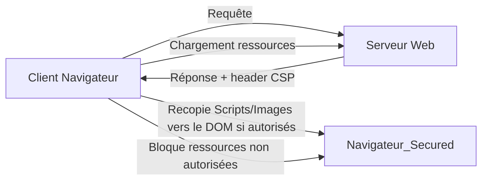

# Séance 4 – Sécurité frontend et APIs  
## Partie 3 – Règles Content Security Policy (CSP)  
### 1. Introduction aux CSP et leur rôle dans la prévention des injections  

---

### A. Qu’est-ce que la Content Security Policy (CSP) ?  

La Content Security Policy est un mécanisme de sécurité Web défini par une directive HTTP ou une balise `<meta>` qui permet au serveur de contrôler les sources autorisées pour le chargement de ressources (scripts, styles, images, polices, etc.) dans un document web.  

L’objectif principal est de réduire le risque d’attaques par **injections de code malveillant** (notamment les Cross-Site Scripting - XSS) en limitant l’exécution ou le chargement à des sources de confiance explicitement définies.  

---

### B. Pourquoi utiliser une CSP ?  

- **Blocage des scripts non autorisés** et des contenus injectés par des attaquants (ex: scripts XSS).  
- **Réduction de la surface d’attaque côté client** même si une faille existe ailleurs dans l’application.  
- **Rapports d’incidents** via des rapports CSP (report-uri/report-to) pour détecter les tentatives d’attaques.  
- **Renforcement du contrôle sur les ressources chargées** (images, styles, cadres, etc.).  

---

### C. Fonctionnement d’une CSP  

La politique est définie dans l’en-tête HTTP `Content-Security-Policy` avec plusieurs directives listant les sources autorisées selon les types de contenu.  

#### Exemple simple de Header CSP

```
Content-Security-Policy: default-src 'self'; script-src 'self' https://apis.google.com; img-src 'self' https:;
```

- `default-src 'self'` : toutes les ressources doivent provenir du même domaine.  
- `script-src 'self' https://apis.google.com` : autorise les scripts venant du même domaine et de googleapis.com.  
- `img-src 'self' https:` : seules les images du domaine d’origine et via HTTPS sont acceptées.  

---

### D. Exemple d’intégration CSP dans une application web  

```html
<head>
  <meta http-equiv="Content-Security-Policy" content="default-src 'self'; script-src 'self' https://cdn.example.com; style-src 'self' 'unsafe-inline';">
</head>
```

Ou via configuration serveur (exemple pour Nginx) :  

```nginx
add_header Content-Security-Policy "default-src 'self'; script-src 'self' https://cdn.example.com; style-src 'self' 'unsafe-inline';";
```

---

### E. Diagramme Mermaid – Contrôle de chargement avec CSP



---

### F. Directives CSP importantes  

| Directive       | Description                               | Exemple                               |
|-----------------|-------------------------------------------|-------------------------------------|
| `default-src`   | Source par défaut pour toutes les ressources non explicitement définies | `default-src 'self'`                |
| `script-src`    | Sources autorisées pour les scripts       | `script-src 'self' 'nonce-abc123'` |
| `style-src`     | Sources autorisées pour les styles CSS    | `style-src 'self' 'unsafe-inline'`  |
| `img-src`       | Sources des images                         | `img-src 'self' https:`             |
| `connect-src`   | Sources autorisées pour les requêtes AJAX/WebSocket | `connect-src 'self' https://api.example.com`  |
| `frame-src`     | Sources autorisées pour iframes           | `frame-src https://trusted.com`     |
| `report-uri`    | URL pour recevoir les rapports d’erreur CSP | `report-uri /csp-violation-report`  |

---

### G. Points clés  

- Éviter l’usage de `'unsafe-inline'` dans `script-src` pour ne pas permettre l’exécution de scripts inline non sécurisés.  
- Utiliser des **nonces** ou des **hashes** pour autoriser certains scripts inline spécifiques.  
- Tester et corriger les erreurs détectées via les rapports CSP pour affiner la politique.  
- La CSP ne remplace pas l’échappement/sanitisation des entrées, elle constitue une couche de protection complémentaire.  

---

### H. Sources  

- MDN Web Docs – Content Security Policy : https://developer.mozilla.org/fr/docs/Web/HTTP/Headers/Content-Security-Policy  
- OWASP CSP Cheat Sheet : https://cheatsheetseries.owasp.org/cheatsheets/Content_Security_Policy_Cheat_Sheet.html  
- W3C CSP Specification : https://www.w3.org/TR/CSP3/  

---

### Synthèse  

La Content Security Policy est une mesure puissante pour prévenir les injections de scripts malveillants en limitant strictement les sources autorisées de contenu dans un site web. Par la définition précise de règles sur les sources, ces politiques réduisent le risque d’attaque XSS et contribuent à sécuriser l’environnement d’exécution JavaScript côté client, tout en offrant un outil utile pour surveiller les violations via des rapports dédiés.