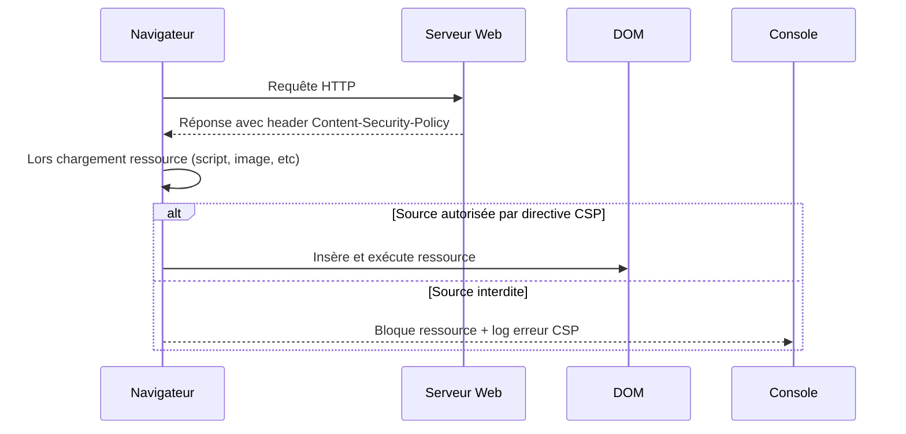

# Séance 4 – Sécurité frontend et APIs  
## Partie 3 – Règles Content Security Policy (CSP)  
### 2. Définition et implémentation de directives CSP  

---

### A. Rappel : Qu’est-ce qu’une directive CSP ?  

Une directive CSP est une règle spécifique qui contrôle le chargement ou l’exécution de certains types de ressources sur une page web (scripts, styles, images, etc.). Chaque directive définit une ou plusieurs **sources** autorisées, qui peuvent être des domaines, des mots-clés, ou des expressions (ex: `'self'`, `'nonce-...'`, `https://exemple.com`).  

La politique complète est une chaîne d’instructions composée de multiples directives.  

---

### B. Principales directives CSP et leurs usages  

| Directive        | Description                               | Exemple d’utilisation typique                   |
|------------------|-------------------------------------------|-----------------------------------------|
| `default-src`    | Définit une source par défaut pour tout type de contenu non explicitement contrôlé | `default-src 'self'` (seules les ressources du site sont autorisées)  |
| `script-src`     | Sources autorisées pour les scripts JS        | `script-src 'self' https://cdn.example.com` |
| `style-src`      | Sources autorisées pour les styles CSS         | `style-src 'self' 'unsafe-inline'` (autorisant les styles inline)  |
| `img-src`        | Sources pour les images                          | `img-src 'self' data:` (autorise images encodées base64)            |
| `connect-src`    | Contrôle les sources pour les requêtes AJAX/WebSocket | `connect-src 'self' https://api.example.com`  |
| `font-src`       | Sources autorisées pour les polices              | `font-src 'self' https://fonts.gstatic.com`       |
| `frame-src`      | Sources autorisées pour les iframe               | `frame-src https://player.vimeo.com`          |
| `object-src`     | Contrôle le chargement d’objets comme Flash, plugins | `object-src 'none'` (blocage complet recommandé)        |
| `report-uri` / `report-to` | URL pour recevoir les rapports d’erreur CSP | `report-uri /csp-report-endpoint`  |

---

### C. Exemples concrets d’implémentation CSP  

#### 1. Politique restrictive pour un site classique

```http
Content-Security-Policy: default-src 'self'; script-src 'self'; style-src 'self' 'unsafe-inline'; img-src 'self' data:; object-src 'none';
```

- Tous les contenus doivent provenir du même domaine (`'self'`).  
- Les scripts uniquement depuis le domaine même.  
- CSS inline autorisé (`'unsafe-inline'`).  
- Images autorisées internes ou encodées inline (`data:`).  
- Prohibition totale d’objets Flash/plugin.  

#### 2. Politique autorisant un CDN de scripts et API

```http
Content-Security-Policy: default-src 'self'; script-src 'self' https://cdn.example.com; connect-src 'self' https://api.example.com; img-src *; style-src 'self';
```

- Scripts autorisés sur le domaine d’origine et CDN.  
- Requêtes AJAX limitées à API spécifique.  
- Images de n’importe quelle origine (à limiter selon besoins).  
- Styles uniquement internes.  

---

### D. Implémentation en HTTP Header ou Meta Tag  

- **HTTP Header** (recommandé) configuré côté serveur (ex : Nginx, Apache, serveur Node.js).  

```nginx
add_header Content-Security-Policy "default-src 'self'; script-src 'self' https://cdn.example.com";
```

- **Balise Meta** dans `<head>` (moins recommandé, moins puissant) :  

```html
<meta http-equiv="Content-Security-Policy" content="default-src 'self'; script-src 'self' https://cdn.example.com;">
```

---

### E. Directive avancée : `script-src` avec nonces ou hash  

Pour autoriser certains scripts inline en toute sécurité, on utilise :  
- **Nonce** (valeur aléatoire générée côté serveur pour chaque réponse) :  

```http
Content-Security-Policy: script-src 'nonce-<random-value>'
```

Dans la page HTML, l’attribut nonce est ajouté aux balises script autorisées :  

```html
<script nonce="random-value">console.log('autorisé');</script>
```

- **Hash** : Le hash SHA256 du contenu d’un script autorise son exécution.  

---

### F. Diagramme Mermaid – Flux de vérification CSP côté navigateur  



---

### G. Recommandations  

- Toujours commencer par une politique stricte avec uniquement `'self'`, puis étendre selon besoins.  
- Éviter les mots clés dangereux comme `'unsafe-inline'` pour les scripts.  
- Utiliser les nonces ou hashes pour scripts inline nécessaires.  
- Profiter des rapports CSP (`report-uri`) pour identifier et corriger les ressources bloquées.  
- Tester systématiquement la politique en mode rapport uniquement avant de la déployer en mode enforcement.  

---

### Sources  

- MDN Content Security Policy – Directive Reference : https://developer.mozilla.org/fr/docs/Web/HTTP/Headers/Content-Security-Policy#source_list  
- OWASP CSP Cheat Sheet : https://cheatsheetseries.owasp.org/cheatsheets/Content_Security_Policy_Cheat_Sheet.html  
- W3C CSP Level 3 Specification : https://www.w3.org/TR/CSP3/  
- Google Web Fundamentals CSP Guide : https://web.dev/content-security-policy/  

---

### Synthèse  

Les directives CSP permettent un contrôle très fin des sources de contenu que le navigateur peut charger et exécuter. Leur configuration adaptée bloque efficacement une majorité d’attaques par injection tout en permettant la flexibilité nécessaire pour intégrer des CDN, APIs externes ou scripts inline officiels. Leur déploiement progressif, utilisant nonces et rapports, facilite une mise en œuvre sécurisée et efficace.