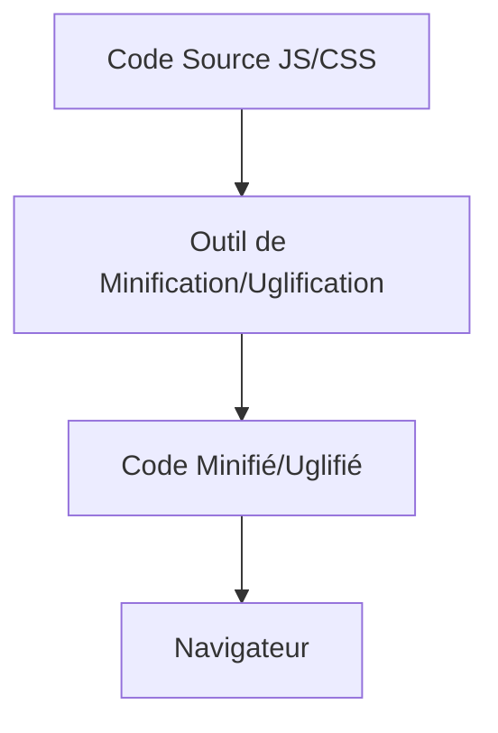

# Séance 5 – Optimisation du code frontend et bonnes pratiques  
## Partie 1 – Performance côté frontend : minification, lazy loading, memoization, code splitting  
### 1. Minification et uglify du code JavaScript et CSS  

---

### A. Définitions  

- **Minification** : processus de réduction de la taille du code source (JS, CSS) en supprimant tous les caractères superflus (espaces, retours à la ligne, commentaires, noms de variables plus longs...) sans modifier son comportement fonctionnel.  
- **Uglify** (uglification) : une forme avancée de minification qui non seulement supprime les espaces mais renomme aussi les variables, fonctions avec des noms très courts, rendant le code plus compact et difficile à lire.  

L’objectif est de réduire le poids des fichiers transférés pour améliorer les temps de chargement et la performance de l’application frontend.  

---

### B. Pourquoi minifier et uglifier le code ?  

1. **Réduction du poids des fichiers**  
   Permet des transferts plus rapides sur le réseau, particulièrement important sur mobiles ou connexions lentes.  
2. **Amélioration du rendu de la page**  
   Moins de données à parser dans le navigateur = affichage plus rapide.  
3. **Rendu du code moins lisible**  
   Dissuade une lecture simple du code source côté client, augmentant la protection contre le reverse engineering léger.  

---

### C. Exemple simple de minification  

**Code JavaScript avant minification :**  

```js
function greet(name) {
  console.log('Hello, ' + name + '!');
}
greet('Alice');
```

**Après minification :**  

```js
function greet(n){console.log("Hello, "+n+"!")}greet("Alice");
```

**Après uglify (avec renommage de variables) :**

```js
function a(b){console.log("Hello, "+b+"!")}a("Alice");
```

---

### D. Outils populaires pour minification et uglification  

- **Terser** (JS) : un outil moderne, compatible ES6+, souvent intégré dans les bundlers comme Webpack ou Rollup.  
- **UglifyJS** : un des premiers outils d'uglification, supporte ES5 principalement.  
- **cssnano** ou **clean-css** : pour la minification CSS.  
- Intégration facilitée dans des workflows via Webpack, Gulp, Parcel, etc.  

---

### E. Exemple d’intégration avec Terser dans un projet Node.js  

```bash
npm install terser -D
```

**Commande pour minifier un fichier JS** :

```bash
npx terser src/app.js -o dist/app.min.js --compress --mangle
```

- `--compress` active les optimisations.  
- `--mangle` renomme les identifiants.  

---

### F. Diagramme Mermaid - Processus de minification et uglification  



---

### G. Bonnes pratiques  

- Conserver une version non minifiée pour le développement et le débogage (sourcemaps).  
- Utiliser des sourcemaps (`.map`) pour faciliter le debug sur les versions minifiées.  
- Vérifier la compatibilité des outils avec la version ECMAScript utilisée.  
- Intégrer la minification dans le pipeline CI/CD pour éviter les oublis.  

---

### H. Sources  

- Terser GitHub : https://github.com/terser/terser  
- MDN Web Docs – Minification : https://developer.mozilla.org/en-US/docs/Glossary/Minification  
- cssnano GitHub : https://github.com/cssnano/cssnano  
- Webpack Terser Plugin : https://webpack.js.org/plugins/terser-webpack-plugin/  

---

### Synthèse  

La minification et l’uglification sont des techniques efficaces pour alléger les fichiers JavaScript et CSS, accélérant le chargement et le rendu des applications front-end. Leur intégration automatisée dans les outils modernes de build garantit une optimisation continue sans altérer la qualité du développement ni la capacité de débogage.