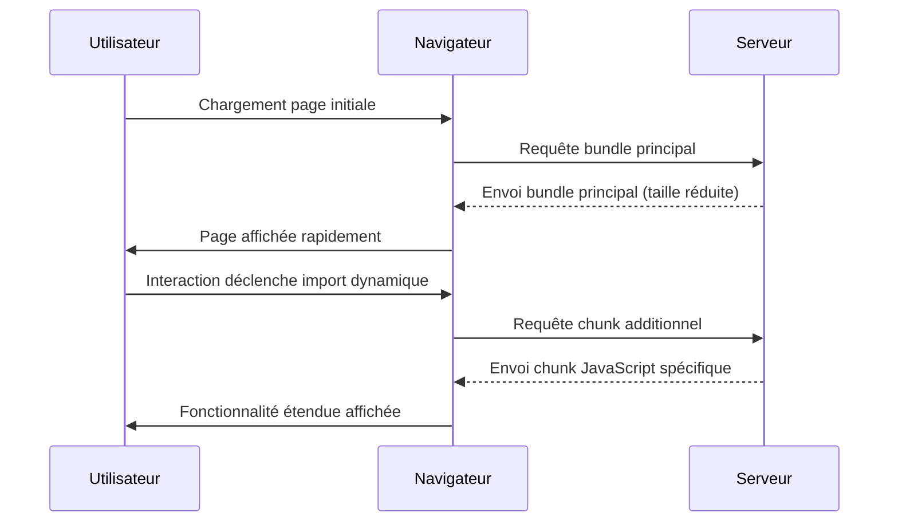

# Séance 5 – Optimisation du code frontend et bonnes pratiques  
## Partie 1 – Performance côté frontend : minification, lazy loading, memoization, code splitting  
### 4. Code splitting pour diviser le bundle JavaScript en morceaux plus petits  

---

### A. Qu’est-ce que le code splitting ?  

Le **code splitting** est une technique d’optimisation qui consiste à découper le bundle JavaScript principal en plusieurs fichiers plus petits, chargés à la demande plutôt qu'en une seule fois au démarrage.  

Cela permet de réduire la taille initiale du bundle téléchargé par le navigateur, améliorant ainsi les performances de chargement et la réactivité des applications web modernes.  

---

### B. Objectifs et bénéfices du code splitting  

- Réduire le **temps de chargement initial** (First Load).  
- Charger uniquement le code nécessaire à la page ou fonctionnalité affichée.  
- Permettre un chargement **asynchrone** et différé des portions de code.  
- Améliorer l’expérience utilisateur, notamment sur réseaux mobiles ou lents.  

---

### C. Techniques de code splitting  

1. **Entrypoint splitting** (point d’entrée multiple) : diviser le code base en bundles séparés selon les pages ou points d’entrée de l’application (ex: page d’accueil vs dashboard).  
2. **Dynamic import** (importation dynamique) : charger un module JavaScript uniquement lorsqu’il est nécessaire par programmation.  
3. **Vendor splitting** : isoler les bibliothèques tierces (React, lodash, etc.) en bundles séparés pour être mises en cache indépendamment.  

---

### D. Exemple d’import dynamique avec Webpack (ES2020)  

```javascript
button.addEventListener('click', () => {
  import('./moduleHeavy.js')
    .then(module => {
      module.loadFeature();
    })
    .catch(err => {
      console.error("Erreur chargement du module", err);
    });
});
```

- Ici `moduleHeavy.js` n’est chargé que lorsque l’utilisateur clique.  
- Webpack détecte ce import dynamique et crée un chunk dédié.  

---

### E. Intégration avec React - Lazy loading et code splitting  

React supporte le code splitting via `React.lazy()` et `Suspense` pour rendre les composants chargés dynamiquement.  

```jsx
import React, { Suspense, lazy } from 'react';

const HeavyComponent = lazy(() => import('./HeavyComponent'));

function App() {
  return (
    <Suspense fallback={<div>Chargement...</div>}>
      <HeavyComponent />
    </Suspense>
  );
}
```

---

### F. Diagramme Mermaid – Flux du code splitting dynamique  



---

### G. Bonnes pratiques  

- Définir clairement les points de chargement différé dans l’architecture applicative.  
- Garder les chunks suffisamment petits pour un chargement rapide mais éviter un morcellement excessif (trop de petites requêtes HTTP).  
- Exploiter les outils de bundling (Webpack, Rollup, Parcel) pour automatiser le découpage.  
- Utiliser les outils de mesure (Lighthouse, Webpack Bundle Analyzer) pour contrôler et optimiser les bundles.  
- Associer code splitting et lazy loading pour une meilleure performance globale.  

---

### H. Sources  

- Webpack Documentation – Code Splitting : https://webpack.js.org/guides/code-splitting/  
- React Documentation – Code Splitting : https://reactjs.org/docs/code-splitting.html  
- Google Developers – Code Splitting and Lazy Loading : https://web.dev/code-splitting/  
- MDN – Dynamic import() : https://developer.mozilla.org/en-US/docs/Web/JavaScript/Reference/Statements/import#dynamic_imports  

---

### Synthèse  

Le code splitting est une stratégie clé pour optimiser la performance des applications frontend en divisant le bundle JavaScript en morceaux plus légers chargés à la demande. Couplé au lazy loading, il allège la charge initiale et favorise une meilleure expérience utilisateur, en particulier sur des connexions lentes. Son adoption avec des outils modernes et les bonnes pratiques adaptées permet de maîtriser la complexité tout en maximisant les gains de performance.