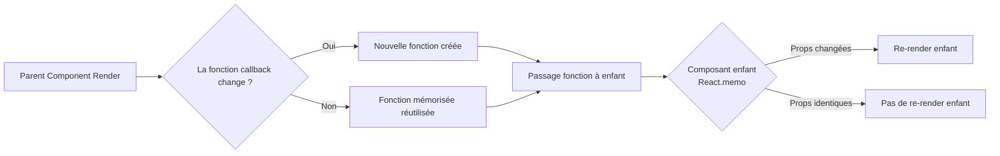

# Séance 5 – Optimisation du code frontend et bonnes pratiques  
## Partie 2 – Optimisation React : `useMemo`, `useCallback`, éviter les re-renders inutiles  
### 2. Utilisation des hooks `useCallback` pour mémoriser les fonctions  

---

### A. Comprendre le hook `useCallback`  

Le hook React **`useCallback`** permet de **mémoriser une fonction** pour que sa référence reste stable entre les rendus, sauf si les dépendances spécifiées changent.  

Dans React, les fonctions créées dans le corps d’un composant sont recréées à chaque rendu, ce qui peut entraîner des rendus inutiles dans les composants enfants si ces fonctions sont passées en props.  

`useCallback` évite ce problème en renvoyant la même fonction mémorisée tant que ses dépendances n’évoluent pas.  

---

### B. Syntaxe  

```jsx
const memoizedCallback = useCallback(() => {
  // code de la fonction
}, [dependencies]);
```

- La fonction est créée une fois, puis réutilisée si les `dependencies` n'ont pas changé.  
- Si une dépendance change, une nouvelle fonction est créée au prochain rendu.  

---

### C. Pourquoi utiliser `useCallback` ?  

- Éviter que les callbacks passés en props ne soient recréés à chaque rendu, réduisant ainsi les re-renders inutiles des composants enfants mémorisés avec `React.memo`.  
- Optimiser les performances des composants qui dépendent de fonctions stables.  
- Favoriser l’optimisation globale lors d’interactions fréquentes (événements, callbacks).  

---

### D. Exemple simple  

```jsx
import React, { useState, useCallback } from 'react';

const Button = React.memo(({ onClick, label }) => {
  console.log(`Rendu bouton ${label}`);
  return <button onClick={onClick}>{label}</button>;
});

function App() {
  const [count, setCount] = useState(0);

  const increment = useCallback(() => {
    setCount(c => c + 1);
  }, []);

  return (
    <div>
      <p>Compteur : {count}</p>
      <Button onClick={increment} label="Incrémenter" />
    </div>
  );
}
```

- Sans `useCallback`, `increment` serait recréée à chaque rendu, forçant le rerender du `Button` même si ses props n'ont pas changé.  
- Avec `useCallback`, la référence est stable, le `Button` ne se rerendra pas inutilement grâce à `React.memo`.  

---

### E. Diagramme Mermaid – Impact de `useCallback` sur le cycle de rendu  



---

### F. Bonnes pratiques  

- Utiliser `useCallback` surtout pour passer des callbacks à des composants mémorisés (`React.memo`).  
- Ne pas trop généraliser son usage car `useCallback` ajoute une surcharge mémoire et complexité.  
- Toujours fournir les dépendances correctes pour éviter des bugs ou des fonctions obsolètes.  
- Coupler avec `useMemo` pour mémoriser les valeurs si nécessaire mais savoir différencier usage.  

---

### G. Sources  

- React Documentation – useCallback : https://fr.reactjs.org/docs/hooks-reference.html#usecallback  
- Kent C. Dodds – When to use useCallback : https://kentcdodds.com/blog/usecallback-and-usememo  
- LogRocket Blog – Practical useCallback examples in React : https://blog.logrocket.com/practical-guide-to-usememo-and-usecallback-in-react/  

---

### Synthèse  

`useCallback` stabilise la référence des fonctions entre les rendus React, évitant ainsi des recalculs et re-renders inutiles dans les composants enfants optimisés. Appliqué judicieusement, ce hook contribue à rendre les applications React plus performantes et réactives, en particulier lors de la gestion d’événements ou callbakcs passés en props.