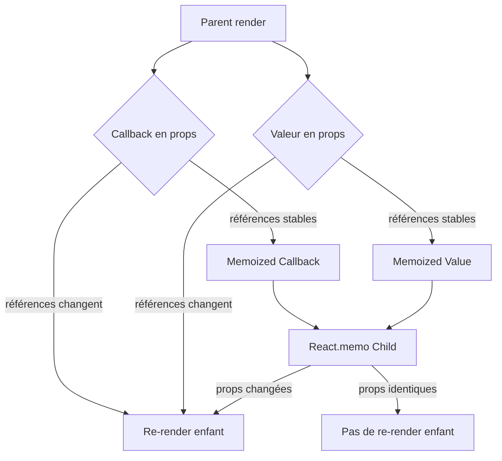

# Séance 5 – Optimisation du code frontend et bonnes pratiques  
## Partie 2 – Optimisation React : `useMemo`, `useCallback`, éviter les re-renders inutiles  
### 3. Identification et résolution des causes de re-renders inutiles des composants  

---

### A. Comprendre les causes des re-renders inutiles  

Dans React, un **re-render** d'un composant se déclenche lorsque :  

- Ses **props** changent (par comparaison par référence).  
- Son **state** est modifié.  
- Son **parent** est re-rendu (si le composant n'est pas optimisé).  

Les **re-renders inutiles** surviennent quand un composant se réaffiche sans que ses données aient réellement changé, ce qui dégrade la performance globale de l’application.  

---

### B. Identifier les re-renders inutiles  

#### Outils et techniques  

- **React Developer Tools (Profiler)**  
  Permet de visualiser quels composants se re-render et le temps consommé lors du rendu.  
- **Console.log** dans la fonction de rendu pour tracer les exécutions.  
- Utilisation de la méthode **`React.memo`** avec un logging sur les props pour observer les rendus.  

---

### C. Causes fréquentes des re-renders inutiles  

1. **Passage d’objets/fonctions non mémorisés en props**  
   Les objets et fonctions sont recréés à chaque rendu, leurs références changent, forçant le re-render de composants enfants.  

2. **Modification non nécessaire du state**  
   Modifier le state à la même valeur déclenche tout de même un rendu.  

3. **Absence de `React.memo` pour des composants fonctionnels**  
   Sans cela, les composants enfants se rerendent systématiquement quand le parent le fait.  

4. **Contexte React modifié**  
   Tout consommateur du contexte se re-render dès que la valeur contextuelle change, même si l’information n’est pas utilisée.  

---

### D. Résolutions et bonnes pratiques  

#### 1. Mémoriser les fonctions avec `useCallback`  

Exemple :  

```jsx
const handleClick = useCallback(() => {
  // logiques ici
}, []);
```

#### 2. Mémoriser les valeurs avec `useMemo`  

```jsx
const filteredData = useMemo(() => {
  return data.filter(item => item.active);
}, [data]);
```

#### 3. Utiliser `React.memo`  

```jsx
const ChildComponent = React.memo(({ value }) => {
  console.log('Rendu ChildComponent');
  return <div>{value}</div>;
});
```

#### 4. Eviter les modifications redondantes du state  

```jsx
// Mauvais
setCount(count);

// Correct, ne déclenche pas de rendu inutile
setCount(prev => {
  if (prev === count) return prev;
  return count;
});
```

#### 5. Fragmenter le contexte ou utiliser des sélecteurs personnalisés  

---

### E. Exemple complet  

```jsx
import React, { useState, useCallback, useMemo } from 'react';

const Child = React.memo(({ onClick, items }) => {
  console.log('Child rendu');
  return (
    <div>
      <button onClick={onClick}>Cliquez-moi</button>
      <ul>
        {items.map(i => (<li key={i}>{i}</li>))}
      </ul>
    </div>
  );
});

function Parent() {
  const [count, setCount] = useState(0);
  const [items, setItems] = useState(['pomme', 'banane', 'cerise']);

  const handleClick = useCallback(() => {
    setCount(c => c + 1);
  }, []);

  const filteredItems = useMemo(() => items.filter(item => item.startsWith('b')), [items]);

  return (
    <div>
      <p>Compteur : {count}</p>
      <Child onClick={handleClick} items={filteredItems} />
    </div>
  );
}
```

- `Child` ne se re-rendera que si `handleClick` ou `filteredItems` changent.  
- Les références sont stables grâce à `useCallback` et `useMemo`.  

---

### F. Diagramme Mermaid – Flux du re-render optimisé  



---

### G. Sources  

- React Documentation – Memoization : https://fr.reactjs.org/docs/react-api.html#reactmemo  
- React Documentation – Optimizing performance : https://reactjs.org/docs/optimizing-performance.html  
- Kent C. Dodds – Prevent unnecessary re-renders in React : https://kentcdodds.com/blog/usememo-and-usecallback  
- LogRocket Blog – How to avoid unnecessary re-renders with React memo, useMemo and useCallback : https://blog.logrocket.com/usememo-vs-usecallback-react-hooks-performance/  

---

### Synthèse  

Les re-renders inutiles sont souvent liés à des références d’objets ou fonctions qui changent, des états modifiés sans changement de valeur, ou l’absence de mémorisation des composants. Identifier ces causes à l’aide d’outils et appliquer `useMemo`, `useCallback` et `React.memo` sont des méthodes efficaces pour limiter la surcharge et améliorer sensiblement la fluidité des applications React.