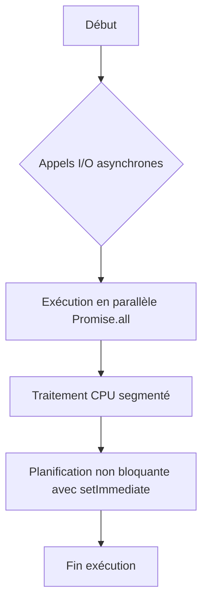

# Séance 5 – Optimisation du code frontend et bonnes pratiques  
## Partie 3 – Node.js : event loop, async/await vs Promises, éviter le blocage  
### 3. Techniques pour écrire du code non-bloquant et optimiser les performances I/O  

---

### A. Principes du code non-bloquant en Node.js  

Node.js fonctionne sur un modèle à thread unique avec une **event loop** qui gère l’exécution asynchrone. Écrire du code non-bloquant signifie :  
- Ne jamais empêcher la boucle d’événements de continuer à traiter d’autres tâches.  
- Utiliser les API asynchrones pour les opérations I/O lourdes (lecture fichier, requêtes réseau, accès base de données).  
- Privilégier les callbacks, Promises, ou async/await dans une logique asynchrone.  

Bloquer la boucle événementielle (ex: traitements lourds synchrones) impacte la réactivité globale et les performances.  

---

### B. Techniques clés pour éviter le blocage  

#### 1. Utiliser les API I/O asynchrones de Node.js  

Node.js expose des versions asynchrones des fonctions I/O, à préférer impérativement.  

```js
// Mauvais - lecture synchrone de fichier (bloquant)
const data = fs.readFileSync('fichier.txt', 'utf-8');

// Bon - lecture asynchrone (non bloquant)
fs.readFile('fichier.txt', 'utf-8', (err, data) => {
  if (err) throw err;
  console.log(data);
});
```

#### 2. Exploiter les Promises et async/await  

Ces abstractions rendent la gestion asynchrone plus claire et évitent les callbacks imbriqués (callback hell).  

```js
const fs = require('fs').promises;

async function lireFichier() {
  try {
    const data = await fs.readFile('fichier.txt', 'utf-8');
    console.log(data);
  } catch (err) {
    console.error(err);
  }
}
```

#### 3. Paralléliser avec `Promise.all` pour I/O indépendantes  

Si plusieurs I/O peuvent être faites en parallèle, les lancer simultanément plutôt que les attendre séquentiellement.  

```js
async function chargerPlusieursFichiers() {
  const [data1, data2] = await Promise.all([
    fs.readFile('fichier1.txt', 'utf-8'),
    fs.readFile('fichier2.txt', 'utf-8')
  ]);
  console.log(data1, data2);
}
```

#### 4. Découper les traitements lourds synchrones avec `setImmediate` ou `process.nextTick`  

Pour ne pas bloquer l’event loop, les traitements lourds peuvent être segmentés en tâches plus petites à exécuter ensuite.  

```js
function traitementLourd(items) {
  let i = 0;

  function traiterParParties() {
    const start = Date.now();
    while (i < items.length && (Date.now() - start) < 50) { // 50ms max sans blocage
      // traitement d'un item
      i++;
    }
    if (i < items.length) {
      setImmediate(traiterParParties); // planifie la suite sans bloquer
    }
  }

  traiterParParties();
}
```

---

### C. Éviter les appels synchrones profondément bloquants  

Chaque appel synchrones (`readFileSync`, calcul CPU intensif) stoppe l’event loop ce qui paralyse l’ensemble du serveur.  

Pour le calcul intensif, une solution est d’externaliser via :  
- **Worker threads** (Node.js >=10.5) pour paralléliser le calcul CPU intensif.  
- Un service dédié (microservice) hors Node.js si besoin.  

---

### D. Exemple global combiné  

```js
const fs = require('fs').promises;

async function traitementMultiple() {
  try {
    const fichiers = ['f1.txt', 'f2.txt', 'f3.txt'];

    // Lecture parallèle des fichiers
    const contenus = await Promise.all(
      fichiers.map(f => fs.readFile(f, 'utf-8'))
    );

    // Traitement non-bloquant simulé
    let i = 0;
    function traiter() {
      const start = Date.now();
      while (i < contenus.length && (Date.now() - start) < 10) {
        console.log(`Traitement de: ${contenus[i]}`);
        i++;
      }
      if (i < contenus.length) {
        setImmediate(traiter); // Découpage non bloquant
      }
    }
    traiter();

  } catch (err) {
    console.error(err);
  }
}

traitementMultiple();
```

---

### E. Diagramme Mermaid – Cycle asynchrone non bloquant  



---

### F. Sources  

- Node.js Documentation – Asynchronous APIs : https://nodejs.org/api/fs.html#file-system  
- Node.js Documentation – Worker Threads : https://nodejs.org/api/worker_threads.html  
- Node.js Guide – Event Loop, Timers, and process.nextTick : https://nodejs.org/en/docs/guides/event-loop-timers-and-nexttick/  
- RisingStack Blog – Best Practices to write non-blocking Node.js code : https://blog.risingstack.com/node-js-best-practices-write-non-blocking-code/  

---

### Synthèse  

Pour exploiter pleinement le potentiel non bloquant de Node.js, il faut systématiquement utiliser les API asynchrones natives, paralléliser les I/O indépendantes avec `Promise.all`, fractionner les traitements CPU lourds en tâches plus fines planifiées avec `setImmediate` ou `process.nextTick`, et éviter les appels synchrones bloquants dans le thread principal. Ces habitudes garantissent une application réactive et performante.